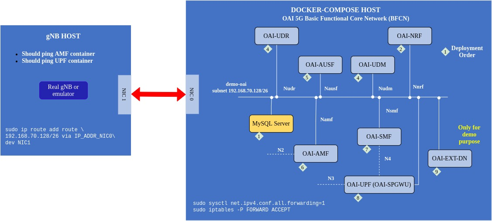

<table style="border-collapse: collapse; border: none;">
  <tr style="border-collapse: collapse; border: none;">
    <td style="border-collapse: collapse; border: none;">
      <a href="http://www.openairinterface.org/">
         
         </img>
      </a>
    </td>
    <td style="border-collapse: collapse; border: none; vertical-align: center;">
      <b><font size = "5">OpenAirInterface 5G Core Network Basic Deployment using Docker-Compose</font></b>
    </td>
  </tr>
</table>




**OVERVIEW**

This tutorial will help in understanding how to deploy a `basic` OAI core network using docker-compose.

* In this tutorial we have used [dsTest](https://www.developingsolutions.com/products/dstest-5g-core-network-testing/), a commercial paid gNB emulator.
* Though, instead of this, readers can also use `gNBsim` (an opensource gNB emulator), you can follow another tutorial for [this](./DEPLOY_SA5G_WITH_GNBSIM.md).
* Readers could also replace the RAN emulator by a real RAN, it means the `so-called dsTest Host` could be a real `gNB`.

Please follow the tutorial step by step to create a stable working testbed. 

**Reading time: ~20mins**

**Tutorial replication time: ~1hr**

Note: In case readers are interested in deploying debuggers/developers core network environment with more logs please follow [this tutorial](./DEBUG_5G_CORE.md)

**TABLE OF CONTENTS**

1.  [Basic Deployment Flavours](#1-basic-deployment-flavours)
2.  [Pre-requisites](#2-pre-requisites)
3.  [Network Function Container Images](#3-network-function-container-images)
4.  [Configuring Host Machines](#4-configuring-host-machines)
5.  [Configuring OAI 5G Core Network Functions](#5-configuring-the-oai-5g-core-network-functions)
6.  [Configuring dsTest Scenario](#6-configuring-dstester-scenario)
7.  [Deploying OAI 5G Core Network](#7-deploying-oai-5g-core-network)
8.  [Executing dsTest Scenario](#8-executing-the-dstest-scenario)
9.  [Reference Logs](#9-reference-logs)
10. [Notes](#10-notes)

## 1. Basic Deployment Flavours ##

The Basic functional 5g core network can be deployed into 2 scenarios:

    - Scenario I:  AMF, SMF, UPF (SPGWU), NRF, UDM, UDR, AUSF, MYSQL
    - Scenario II:  AMF, SMF, UPF (SPGWU), UDM, UDR, AUSF, MYSQL

## 2. Pre-requisites ##

The container images are built using `docker build` command on Ubuntu 18.04 host machine. The base image for all the containers is Ubuntu 18.04. 

The requried softwares and their respected versions are listed below. To replicate the testbed use these versions. 


| Software                   | Version                         |
|:-------------------------- |:------------------------------- |
| docker engine              | 19.03.6, build 369ce74a3c       |
| docker-compose             | 1.27.4, build 40524192          |
| Host operating system      | Ubuntu 18.04.4 LTS              |
| Container operating system | Ubuntu 18.04                    |
| dsTest (Licensed)          | 5.5                             |
| tshark                     | 3.4.4 (Git commit c33f6306cbb2) |
| wireshark                  | 3.4.4 (Git commit c33f6306cbb2) |

### 2.1. Wireshark ###

The new version of `wireshark` may not be available in the ubuntu repository:

- So it is better to build it from source.

You may also use the developer PPA:

```bash
sudo add-apt-repository ppa:wireshark-dev/stable
sudo apt update
sudo apt install wireshark

wireshark --version
Wireshark 3.4.7 (Git v3.4.7 packaged as 3.4.7-1~ubuntu18.04.0+wiresharkdevstable1)
```

### 2.2. Networking considerations ###

Most of the times the `docker-compose-host` machine is not configured with packet forwarding then it can be done using below command (if you have already done it in any other section then don't repeat).

**This is the most important step towards end-to-end connectivity.**

```bash
(docker-compose-host)$ sudo sysctl net.ipv4.conf.all.forwarding=1
(docker-compose-host)$ sudo iptables -P FORWARD ACCEPT
```

To know how to configure the machine with the above requirements vist [pre-requisites](./DEPLOY_PRE_REQUESITES.md) page.

## 3. Network Function Container Images ##

- In this demo the network function branch and tags which were used are listed below, follow the [Retrieving images](./RETRIEVE_OFFICIAL_IMAGES.md) or the [Building images](./BUILD_IMAGES.md) to build images with below tags.

| CNF Name    | Branch Name | Tag      | Ubuntu 18.04 | RHEL8 (UBI8)    |
| ----------- | ----------- | -------- | ------------ | ----------------|
| AMF         | `master`    | `v1.2.0` | X            | X               |
| SMF         | `master`    | `v1.2.0` | X            | X               |
| NRF         | `master`    | `v1.2.0` | X            | X               |
| SPGW-U-TINY | `master`    | `v1.1.3` | X            | X               |
| UDR         | `master`    | `v1.2.0` | X            | X               |
| UDM         | `master`    | `v1.2.0` | X            | X               |
| AUSF        | `master`    | `v1.2.0` | X            | X               |

- In case readers are interested in making images using different branch then **they have to build images from scratch they can't use the docker-hub images**.

## 4. Configuring Host Machines ##

This section is similar to the [Section 4 in the minimalist-deployment](./DEPLOY_SA5G_MINI_DS_TESTER_DEPLOYMENT.md#4-configuring-host-machines).

## 5. Configuring the OAI-5G Core Network Functions ##

### 5.1. Core Network Configuration ###

The docker-compose file has configuration parameters of each core network component. The file is pre-configured with parameters related to this scenario. The table contains the location of the configuration files. These files contains allowed configurable parameters. **Keep checking this file it is possible that we will add new parameters for new features.**  

| File Name   | Repository                                   | Location        |
|:----------- |:-------------------------------------------- |:--------------- |
| amf.conf    | (Gitlab) cn5g/oai-cn5g-amf                   | [etc/amf.conf](https://gitlab.eurecom.fr/oai/cn5g/oai-cn5g-amf/-/blob/master/etc/amf.conf)    |
| smf.conf    | (Gitlab) cn5g/oai-cn5g-smf                   | [etc/smf.conf](https://gitlab.eurecom.fr/oai/cn5g/oai-cn5g-smf/-/blob/master/etc/smf.conf)    |
| nrf.conf    | (Gitlab) cn5g/oai-cn5g-nrf                   | [etc/nrf.conf](https://gitlab.eurecom.fr/oai/cn5g/oai-cn5g-nrf/-/blob/master/etc/nrf.conf)   |
| spgw_u.conf | (Github) OPENAIRINTERFACE/openair-spgwu-tiny | [etc/spgw_u.conf](https://github.com/OPENAIRINTERFACE/openair-spgwu-tiny/blob/master/etc/spgw_u.conf) |
| udr.conf    | (Gitlab) cn5g/oai-cn5g-udr                   | [etc/udr.conf](https://gitlab.eurecom.fr/oai/cn5g/oai-cn5g-udr/-/blob/master/etc/udr.conf)   |
| udm.conf    | (Gitlab) cn5g/oai-cn5g-udm                   | [etc/udm.conf](https://gitlab.eurecom.fr/oai/cn5g/oai-cn5g-udm/-/blob/master/etc/udm.conf)   |
| ausf.conf   | (Gitlab) cn5g/oai-cn5g-ausf                  | [etc/ausf.conf](https://gitlab.eurecom.fr/oai/cn5g/oai-cn5g-ausf/-/blob/master/etc/ausf.conf)   |


### 5.2. User Subscprition Profile ###

This section is similar to the [Section 5.2 in the minimalist-deployment](./DEPLOY_SA5G_MINI_DS_TESTER_DEPLOYMENT.md#52-user-subscprition-profile).

## 6. Configuring DsTester Scenario ##

This section is similar to the [Section 6 in the minimalist-deployment](./DEPLOY_SA5G_MINI_DS_TESTER_DEPLOYMENT.md#6-configuring-dstester-scenario).

## 7. Deploying OAI 5g Core Network ##

- The core network is deployed using a [python script](../docker-compose/core-network.py) which is a wrapper around `docker-compose` and `docker` command. 
- The script informs the user when the core-network is correctly configured by checking health status of containers and connectivity between different core network components.
- To know how to use the script look for the helper menu as shown below.
- There are three parameters, which can be provided 
  - `--type` mandatory option to start/stop the 5g core components with minimum/basic functional architecture. 
  - `--fqdn` and `--scenario` are optional and if not provided by default it is considered as use fqdn feature with nrf component.
- In case if there is a problem in using the script then use docker-compose manually read the [notes section](#10-notes) 

    ```bash
    (docker-compose-host)$ pwd
    /home/<docker-compose-host>/oai/oai-cn-fed/docker-compose
    (docker-compose-host)$ python3 core-network.py --help

    usage: core-network.py [-h] --type {start-mini,start-basic,stop-mini,stop-basic} [--fqdn {yes,no}] [--scenario {1,2}]

    OAI 5G CORE NETWORK DEPLOY

    optional arguments:
    -h, --help            show this help message and exit
    --type {start-mini,start-basic,stop-mini,stop-basic}, -t {start-mini,start-basic,stop-mini,stop-basic}
                            Functional type of 5g core network ("start-mini"|"start-basic"|"stop-mini"|"stop-basic")
    --fqdn {yes,no}, -fq {yes,no}
                            Deployment scenario with FQDN ("yes"|"no")
    --scenario {1,2}, -s {1,2}
                            Scenario with NRF ("1") and without NRF ("2")

    example:
            python3 core-network.py --type start-mini
            python3 core-network.py --type start-basic
            python3 core-network.py --type stop-mini
            python3 core-network.py --type start-mini --fqdn no --scenario 2
            python3 core-network.py --type start-basic --fqdn no --scenario 2
    ```
- Before executing the script it is better to start capturing packets to see the message flow between smf <--> nrf <--> upf. The packets will be captured on **demo-oai** bridge which should be configured on the `docker-compose-host` machine. 

    ```bash
    (docker-compose-host)$ sudo tshark -i demo-oai 
         -f "not arp and not port 53 and not host archive.ubuntu.com and not host security.ubuntu.com" \
         -w /tmp/5gcn-basic-deployment-nrf.pcap
    ```

- Explanation on the capture filter:
   *  `not arp` : Not capturing ARP traffic
   *  `not port 53` : Not capturing DNS traffic
   *  `not host archive.ubuntu.com and not host security.ubuntu.com` : Not capturing traffic from `oai-ext-dn` container when installing tools
- Starting the core network components, 

    ```bash
    (docker-compose-host)$ python3 core-network.py --type start-basic --fqdn no --scenario 1
    [2021-09-20 13:48:42,355] root:DEBUG:  Starting 5gcn components... Please wait....
    Creating mysql   ... done
    Creating oai-nrf ... done
    Creating oai-udr ... done
    Creating oai-udm ... done
    Creating oai-ausf ... done
    Creating oai-amf  ... done
    Creating oai-smf  ... done
    Creating oai-spgwu ... done
    Creating oai-ext-dn ... done
    
    [2021-09-20 13:49:17,198] root:DEBUG:  OAI 5G Core network started, checking the health status of the containers... takes few secs....
    [2021-09-20 13:49:54,591] root:DEBUG:  All components are healthy, please see below for more details....
    Name                 Command                  State                  Ports            
    -----------------------------------------------------------------------------------------
    mysql        docker-entrypoint.sh mysqld      Up (healthy)   3306/tcp, 33060/tcp         
    oai-amf      /bin/bash /openair-amf/bin ...   Up (healthy)   38412/sctp, 80/tcp, 9090/tcp
    oai-ausf     /bin/bash /openair-ausf/bi ...   Up (healthy)   80/tcp                      
    oai-ext-dn   /bin/bash -c  apt update;  ...   Up                                         
    oai-nrf      /bin/bash /openair-nrf/bin ...   Up (healthy)   80/tcp, 9090/tcp            
    oai-smf      /bin/bash /openair-smf/bin ...   Up (healthy)   80/tcp, 8805/udp, 9090/tcp  
    oai-spgwu    /openair-spgwu-tiny/bin/en ...   Up (healthy)   2152/udp, 8805/udp          
    oai-udm      /bin/bash /openair-udm/bin ...   Up (healthy)   80/tcp                      
    oai-udr      /bin/bash /openair-udr/bin ...   Up (healthy)   80/tcp
    [2021-09-20 13:49:54,591] root:DEBUG:  Checking if the containers are configured....
    [2021-09-20 13:49:54,591] root:DEBUG:  Checking if SMF and UPF registered with nrf core network....
    [2021-09-20 13:49:54,629] root:DEBUG:  For example: oai-smf Registration with oai-nrf can be checked on this url /nnrf-nfm/v1/nf-instances?nf-type="SMF" {"_links":{"item":[{"href":"192.168.70.133"}],"self":""}}....
    [2021-09-20 13:49:54,629] root:DEBUG:  SMF and UPF are registered to NRF....
    [2021-09-20 13:49:54,629] root:DEBUG:  Checking if SMF is able to connect with UPF....
    [2021-09-20 13:49:54,749] root:DEBUG:  UPF receiving heathbeats from SMF....
    [2021-09-20 13:49:54,749] root:DEBUG:  OAI 5G Core network is configured and healthy....
    ```

## 8. Executing the dsTest Scenario ##

- **Scenario Execution**: On the dsTest host run the scenario either using the dsClient GUI or command line. Below are the commands to run it using the command line.

    ```bash
    (dsTest-host)$ dsClient -d 127.0.0.1 -c "source dsTestScenario.xml"
    ```
- **Verify PDN session establishment**: To check if a PDN session is properly estabilished there is an extra external data network container only for this demo purpose. The dsTest UE can be reached using this container to validate the PDN session establishment. To understand the packet flow read the next analysis section. In our settings the UE network is 12.1.1.0/24 the configuration can be seen in smf.conf and spgw_u.conf. The allocated IP address to dsTest UE can be seen in smf logs. Generally, if there is a single UE then the allocated ip address will be 12.1.1.2.

    ```bash
    (docker-compose-host)$ docker exec -it oai-ext-dn ping 12.1.1.2
    64 bytes from 12.1.1.2: icmp_seq=3 ttl=63 time=0.565 ms
    64 bytes from 12.1.1.2: icmp_seq=4 ttl=63 time=0.629 ms
    64 bytes from 12.1.1.2: icmp_seq=5 ttl=63 time=0.542 ms
    64 bytes from 12.1.1.2: icmp_seq=6 ttl=63 time=0.559 ms
    ^c
    ```

- **Stop PCAP collection**: Stop the wireshark or tshark process on the docker-compose-host.

- **Undeploy the core network**: Before undeploying collect all the logs from each component for analysis. 

    ```bash
    (docker-compose-host)$ docker logs oai-amf > amf.log 2>&1
    (docker-compose-host)$ docker logs oai-smf > smf.log 2>&1
    (docker-compose-host)$ docker logs oai-nrf > nrf.log 2>&1
    (docker-compose-host)$ docker logs oai-spgwu > spgwu.log   2>&1
    (docker-compose-host)$ docker logs oai-udr > udr.log 2>&1
    (docker-compose-host)$ docker logs oai-udm > udm.log 2>&1
    (docker-compose-host)$ docker logs oai-ausf > ausf.log 2>&1
    (docker-compose-host)$ python3 core-network.py --type stop-basic --fqdn no --scenario 1
    [2021-09-20 13:52:09,345] root:DEBUG:  UnDeploying OAI 5G core components....
    Stopping oai-ext-dn ... done
    Stopping oai-spgwu  ... done
    Stopping oai-smf    ... done
    Stopping oai-amf    ... done
    Stopping oai-ausf   ... done
    Stopping oai-udm    ... done
    Stopping oai-udr    ... done
    Stopping mysql      ... done
    Stopping oai-nrf    ... done
    Removing oai-ext-dn ... done
    Removing oai-spgwu  ... done
    Removing oai-smf    ... done
    Removing oai-amf    ... done
    Removing oai-ausf   ... done
    Removing oai-udm    ... done
    Removing oai-udr    ... done
    Removing mysql      ... done
    Removing oai-nrf    ... done
    Network demo-oai-public-net is external, skipping
    
    [2021-09-20 13:53:35,170] root:DEBUG:  OAI 5G core components are UnDeployed....
    ```

## 9. Reference logs ##


| PCAP/LOG files for Basic w/ NRF                                                             | PCAP/LOG files for Basic w/o NRF |
|:------------------------------------------------------------------------------------------- | -------------------------------- |
| [5gcn-basic-deployment-nrf.pcap](./results/dsTest/basic-nrf/5gcn-basic-deployment-nrf.pcap) | [5gcn-basic-deployment-no-nrf.pcap](./results/dsTest/basic-no-nrf/5gcn-basic-deployment-no-nrf.pca) |
| [amf.log](./results/dsTest/basic-nrf/amf.log)                                               | [amf.log](./results/dsTest/basic-no-nrf/amf.log) |
| [ausf.log](./results/dsTest/basic-nrf/ausf.log)                                             | [ausf.log](./results/dsTest/basic-no-nrf/amf.log) |
| [smf.log](./results/dsTest/basic-nrf/smf.log)                                               | [smf.log](./results/dsTest/basic-no-nrf/smf.log) |
| [nrf.log](./results/dsTest/basic-nrf/nrf.log)                                               | |
| [spgwu.log](./results/dsTest/basic-nrf/spgwu.log)                                           | [spgwu.log](./results/dsTest/basic-no-nrf/spgwu.log) |
| [udm.log](./results/dsTest/basic-nrf/udm.log)                                               | [udm.log](./results/dsTest/basic-no-nrf/udm.log) |
| [udr.log](./results/dsTest/basic-nrf/udr.log)                                               | [udr.log](./results/dsTest/basic-no-nrf/udr.log) |


## 10. Notes ##

- The `oai-ext-dn` container is optional and is only required if the user wants to ping the dsTest UE. In general this container is not required except for testing purposes.
- Using the python script from above you can perform minimum `AMF, SMF, UPF (SPGWU), NRF, MYSQL` and basic `AMF, SMF, UPF (SPGWU), NRF, UDM, UDR, AUSF, MYSQL` 5g core funtional testing with `FQDN/IP` based feature along with `NRF/noNRF`. Check the configuration before using the docker compose [files](../docker-compose/).
- This tutorial can be taken as reference to test the OAI 5G core with a COTS UE. The configuration files has to be changed according to the gNB and COTS UE information should be present in the mysql database. 
- Generally, in a COTS UE two PDN sessions are created by default so configure the IMS in SMF properly. Currently some parameters can not be configured via [docker-compose-basic-nrf.yaml](../docker-compose/docker-compose-basic-nrf.yaml). We recommend you directly configure them in the conf file and mount the file in the docker during run time. 
- It is not necessary to use [core-network.py](../docker-compose/core-network.py) bash script, it is possible to directly deploy using `docker-compose` command
- In case you want to deploy debuggers/developers core network environment with more logs please follow [this tutorial](./DEBUG_5G_CORE.md)

    ```
    #To start the containers 
    docker-compose -f <file-name> up -d
    #To check their health status
    docker-compose -f <file-name> ps -a
    #To stop the containers 
    docker-compose -f <file-name> down
    ```
