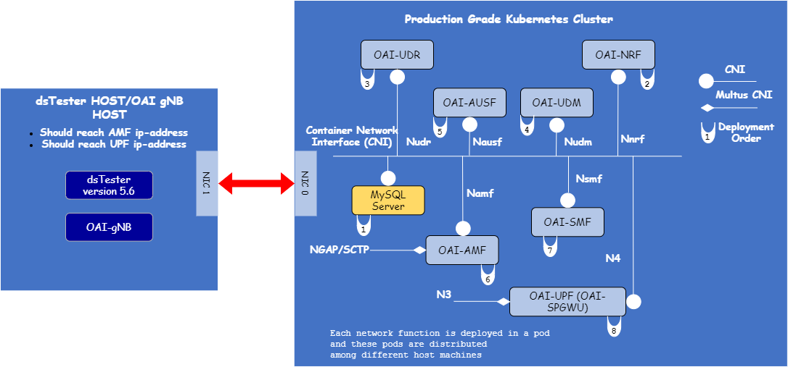

<table style="border-collapse: collapse; border: none;">
  <tr style="border-collapse: collapse; border: none;">
    <td style="border-collapse: collapse; border: none;">
      <a href="http://www.openairinterface.org/">
         
         </img>
      </a>
    </td>
    <td style="border-collapse: collapse; border: none; vertical-align: center;">
      <b><font size = "5">OpenAirInterface 5G Core Network Deployment using Helm Charts</font></b>
    </td>
  </tr>
</table>


The cloud native network functions in production will be deployed using a production grade container orchestrator like kubernetes or Openshift. OAI 5g Core network is being designed to keep up with the latest cloud native deployment scenarios. This release of helm charts is focused on deploying each Cloud-native Network Function(CNF) individually.




**Reading time: ~40mins**

**Tutorial replication time: ~1h30mins**


**TABLE OF CONTENTS**

1.  [Description](#1-description)
2.  [Building Images](#2-building-images)
3.  [Configuring Helm Charts](#3-configuring-helm-charts)
4.  [Deploying Helm Charts](#4-deploying-helm-charts)


## 1. Description

The helm charts can be used on any production grade kubernetes cluster. Currently they are only tested on our inhouse Openshift cluster the cluster information can be found below.

| Software                 | Version                             |
|:------------------------ |:----------------------------------- |
| Openshift Client Version | 4.4.10                              |
| Kubernetes Version       | Kubernetes Version: v1.17.1+45f8ddb |
| helm                     | v3.5.3                              |

### Pre-requisite

The cluster on which these helm charts will be deployed should have RBAC and [Multus CNI](https://github.com/k8snetworkplumbingwg/multus-cni). Multus is necessary to provide multiple interfaces to AMF and UPF/SPGWU. 

## 2. Building Images

The base image used by network function is dependent on the operating system it will be running on. If it is a debian (ubuntu) based cluster then base image will be ubuntu. If it is a RPM (core-os) based cluster then base images will UBI8. Follow the tutorial on [how to build images](./BUILD_IMAGES.md) depending on the cluster/worker-node operating system. In case of Ubuntu based worker nodes, the images can be pulled from [docker-hub](./RETRIEVE_OFFICIAL_IMAGES.md).

## 3. Configuring Helm Charts

Clone the helm chart repository from gitlab repository

```
$ git clone https://gitlab.eurecom.fr/oai/cn5g/oai-cn5g-fed.git
$ git checkout v1.2.0 #check the tag v1.2.0
$ cd charts
$ ls charts
mysql  oai-amf  oai-ausf  oai-nrf  oai-smf  oai-spgwu-tiny  oai-udm  oai-udr
```

Helm chart of every network function looks similar and has the below structure. Only the chart of mysql database is different and the NRF helm chart has an extra pvc.yaml to create a presistant volume for storing tcpdump.

```
Network_function/
├── Chart.yaml
├── templates
│             ├── configmap.yaml
│             ├── deployment.yaml
│             ├── _helpers.tpl
│             ├── multus.yaml
│             ├── NOTES.txt
│             ├── rbac.yaml
│             ├── serviceaccount.yaml
|             └── service.yaml
└── values.yaml 

1 directory, 10 files
```

All the configurable parameters for a particular commit/release are mentioned in the `values.yaml` file. These parameters will keep on changing in the future depending on the nature of development and features. 

**NOTE**: If there is a need to edit a specific configuration parameter that is not configurable via the helm-chart values.yaml file then it has to be changed at the time of building images.

Depending on the namespace where these charts will be instantiated change the value of `namespace` parameter in `values.yaml`. All the network function related configurable parameters are in the sections `config` of the `values.yaml`. To understand the usage and description of each network function configuration parameter refer their [wiki page](https://gitlab.eurecom.fr/oai/cn5g/oai-cn5g-amf/-/wikis/home).

Create a namespace where the helm-charts will be deployed, in our environment we deploy them in `oai` namespace. To create a namespace use the below command on your cluster, 

```bash
# needs a user which has the right to create namespaces
$ kubectl create ns oai
or 
$ oc new-project oai
```


### 3.1 Networking related information

Network functions communicate based on **kubernetes service concept**, the network functions are using FQDN of other network functions to use their service. 

*For example: AMF registers with NRF using NRF FQDN (`oai-nrf-svc.oai.svc.cluster.local`). This way we can get rid of any static ip-address configuration. Though we are still keeping the fields where we are mentioning ip-addresses for example `nrfIpv4Addr` in amf values.yaml but that is not being used if `USE_FQDN_DNS` is set to `true`*

In our environment to reduce complexity and reduce static ip-address allocation we are providing only one interface to each pod (default Kubernetes CNI) except AMF and UPF where we provide two interfaces because gNB or gNB emulator is not running in the cluster environment. N1/N2/NGAP and N3/GTP-U interface are provided using multus CNI to AMF and UPF pod.

**Note**: Each network function can be configured with multiple interfaces using multus CNI if needed. In the `values.yaml` of each network function there are appropriate comments. There is a section `multus` in every value.yaml


```
## Example from ../charts/oai-amf/values.yaml
multus:
  create: false
  n4IPadd: "192.168.18.178"
  n4Netmask: "24"
  n4Gw: "192.168.18.129"
```


### 3.2 Configuring AMF

Open the [values.yaml](../charts/oai-amf/values.yaml) to configure the required parameters. There are many parameters which can be configured. Below are some important parameters,  
```
namespace: "oai"

nfimage:
  registry: local
  repository: rdefosseoai/oai-amf # image name either locally present or in a public/private repository
  version: v1.2.0 # image tag
  # pullPolicy: IfNotPresent or Never or Always
  pullPolicy: Always

tcpdumpimage:
  registry: local
  repository: corfr/tcpdump
  version: latest
  #pullPolicy: IfNotPresent or Never or Always
  pullPolicy: Always

# configure these values based on gNB/emulator configuration
config: 
  mcc: "208"
  mnc: "95"
  regionId: "128"
  amfsetId: "1"
  servedGuamiMcc0: "208"
  servedGuamiMnc0: "95"
  servedGuamiRegionId0: "128"
  servedGuamiAmfSetId0: "1"
  servedGuamiMcc1: "460"
  servedGuamiMnc1: "11"
  servedGuamiRegionId1: "10"
  servedGuamiAmfSetId1: "1"
  plmnSupportMcc: "208"
  plmnSupportMnc: "95"
  plmnSupportTac: "0xa000"
  sst0: "222"
  sd0: "123"
  sst1: "111"
  sd1: "124"
```

The mysql database is pre-configured with some subscriber information. If there is new subscriber information then it should be configured in the mysql database. The subscriber PLMN information should match with gNB and AMF. 

```
  mySqlServer: "mysql"
  mySqlUser: "root"
  mySqlPass: "linux"
  mySqlDb: "oai_db"
  operatorKey: "63bfa50ee6523365ff14c1f45f88737d" (should be the same in mysql)
```


Configure `readinessProbe` and `livenessProbe` by default they are `true` to switch them off change the value with `false`

There are more parametes which can be configured like extra interfaces and resource usage by network function, please refer [values.yaml](../charts/oai-amf/values.yaml). Infront of every parameter there is a comment. 

### 3.3 Configuring SMF

Open [values.yaml](../charts/oai-smf/values.yaml) to configure SMF configuration. DNS configuration which will be shared with the UE based on the DNS used in your environment, it can be 8.8.8.8 or 4.4.4.4 if you don't know your DNS. 

```
namespace: "oai" # namespace where SMF will be deployed 

nfimage:
  registry: local
  repository: rdefosseoai/oai-smf
  version: v1.2.0
  #pullPolicy: IfNotPresent or Never or Always
  pullPolicy: Always

tcpdumpimage:
  registry: local
  repository: corfr/tcpdump
  version: latest
  #pullPolicy: IfNotPresent or Never or Always
  pullPolicy: Always

config:
  dnsIpv4Address: ""
  dnsSecIpv4Address: ""
```

Currenly DNN related information and UE network related information can only be changed at the time of building the SMF network function. Refer [Configure the Containers](./CONFIGURE_CONTAINERS.md) to understand how it can be done. 

Configure `readinessProbe` and `livenessProbe` by default they are `true` to switch them off change the value with `false`

There are more parametes which can be configured like extra interfaces and resource usage by network function, please refer [values.yaml](../charts/oai-smf/values.yaml). Infront of every parameter there is a comment. 

### 3.4 Configuring UPF

Open [values.yaml](../charts/oai-spgwu-tiny/values.yaml) to configure UPF/SPGWU configuration

```
namespace: "oai" # namespace where SMF will be deployed 

nfimage:
  registry: local
  repository: rdefosseoai/oai-spgwu-tiny
  version: v1.1.2
  # pullPolicy: IfNotPresent or Never or Always
  pullPolicy: Always

tcpdumpimage:
  registry: local
  repository: corfr/tcpdump
  version: latest
  #pullPolicy: IfNotPresent or Never or Always
  pullPolicy: Always

config:
  gwId: 1
  mnc: 208 # should match with AMF and SMF and gNB information
  mcc: 95 # should match with AMF and SMF and gNB information
  realm: "3gpp.org" 
  pidDirectory: "/var/run"
```

Configure `readinessProbe` and `livenessProbe` by default they are `true` to switch them off change the value with `false`

There are more parametes which can be configured like extra interfaces and resource usage by network function, please refer [values.yaml](../charts/oai-spgwu-tiny/values.yaml). Infront of every parameter there is a comment. 

### 3.5 Configuring NRF

NRF configuration is straight forward, most of configurable parameters have comment infront of it for explaination. Refer the [values.yaml](../charts/oai-nrf/values.yaml)

```
namespace: "oai"

# NF image
nfimage:
  registry: local
  repository: rdefosseoai/oai-nrf
  version: v1.2.0
  # pullPolicy: IfNotPresent or Never or Always
  pullPolicy: Always

tcpdumpimage:
  registry: local
  repository: corfr/tcpdump
  version: latest
  # pullPolicy: IfNotPresent or Never or Always
  pullPolicy: Always
```

Configure `readinessProbe` and `livenessProbe` by default they are `true` to switch them off change the value with `false`

### 3.6 Configuring subscriber data in MYSQL

Currently the MYSQL is configured with below subscriber data,

```
IMSI - 208950000000030-34
IMEI - 55000000000001
Secret Key (K) - 0x0C0A34601D4F07677303652C0462535B
OPc - 0x63bfa50ee6523365ff14c1f45f88737d
```

To configure new subscriber add a new entry in [values.yaml](../charts/mysql/values.yaml) line 345, add a new entry after 

```
INSERT INTO `users` VALUES (imsi,'380561234567',imei,NULL,'PURGED',50,40000000,100000000,47,0000000000,1,0xkey,0,0,0x40,'ebd07771ace8677a',0xOpC);
```

In above statement change `imsi`, `imei`, `key` and `opc` with appropriate value according to your environment. 

## 4. Deploying Helm Charts

Helm charts have an order of deployment for the proper configuration of core network. 

`mysql --> nrf --> udr --> udm --> ausf --> amf --> smf --> upf(spgwu)`

Once the configuration is finished the charts can be deployed with a user who has the rights to

1. Create RBAC
2. Run pod with privileged and anyuid scc
3. Create multus binds

```
$ helm install mysql mysql/
# wait for the pod to be ready  
$ helm install nrf oai-nrf/
# wait for the pod to be ready
$ helm install udr oai-udr/
# wait for the pod to be ready
$ helm install udm oai-udm/
# wait for the pod to be ready
$ helm install ausf oai-ausf/
# wait for the pod to be ready
$ helm install amf oai-amf/
# wait for the pod to be ready
$ helm install smf oai-smf/
# wait for the pod to be ready 
$ helm install upf oai-spgwu-tiny/
# wait for the pod to be ready 
$ helm list 
NAME  NAMESPACE       REVISION  UPDATED                                   STATUS    CHART                 APP VERSION
amf   oai-5g-develop  1         2021-08-02 14:45:20.055915967 +0200 CEST  deployed  oai-amf-1.1.0         1.1.0      
mysql oai-5g-develop  1         2021-08-02 13:19:21.141268411 +0200 CEST  deployed  mysql-1.6.9           5.7.30     
nrf   oai-5g-develop  1         2021-08-02 14:39:05.615418329 +0200 CEST  deployed  oai-nrf-1.1.0         1.1.0
udr   oai-5g-develop  1         2021-08-02 14:41:06.626418423 +0200 CEST  deployed  oai-udr-1.1.0         1.1.0
udm   oai-5g-develop  1         2021-08-02 14:42:07.715418321 +0200 CEST  deployed  oai-udm-1.1.0         1.1.0
ausf  oai-5g-develop  1         2021-08-02 14:43:05.815319330 +0200 CEST  deployed  oai-ausf-1.1.0        1.1.0      
smf   oai-5g-develop  1         2021-08-02 14:52:53.573249685 +0200 CEST  deployed  oai-smf-1.1.0         1.1.0      
upf   oai-5g-develop  1         2021-08-02 14:49:48.741260605 +0200 CEST  deployed  oai-spgwu-tiny-1.1.2  1.1.2  
$ kubectl get pods
NAME                              READY   STATUS    RESTARTS   AGE
mysql-5dd98b7d97-gh4bz            1/1     Running   0          20m
oai-amf-7bb898fc58-56pr5          2/2     Running   0          10m
oai-nrf-859b987c48-8v94s          2/2     Running   0          16m
oai-udr-951b984c58-4v34d          2/2     Running   0          15m
oai-udm-652b687c43-1v261          2/2     Running   0          13m
oai-ausf-589b183c78-8a92w         2/2     Running   0          11m
oai-smf-678bbc965f-whdr6          2/2     Running   0          2m46s
oai-spgwu-tiny-6c4d68fd45-mpv5v   2/2     Running   0          5m51s
```

## 4.1 How to check if the Core network is properly configured? 

Check the logs `smf` and `upf` to see that the PFCP session is properly configured, 

```
$ kubectl oai-smf-678bbc965f-whdr6 smf | grep 'Received N4 ASSOCIATION SETUP RESPONSE from an UPF'
[2021-08-02T14:52:57.695110] [smf] [smf_n4 ] [info ] Received N4 ASSOCIATION SETUP RESPONSE from an UPF
$ kubectl logs oai-spgwu-tiny-6c4d68fd45-mpv5v spgwu | grep 'Received SX HEARTBEAT REQUEST' | wc -l
60 (should be more than 1)
```

This will verify that `smf` and `upf` have successfully registered to `nrf` and there is a PFCP session. 

Now go ahead and use OAI-gNB/dsTest/gNBSIM or any other gNB or emulator to test the deployed core network.