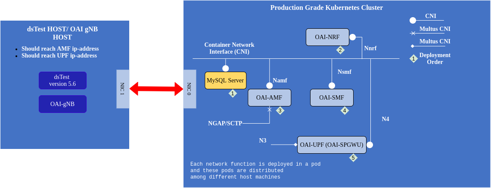
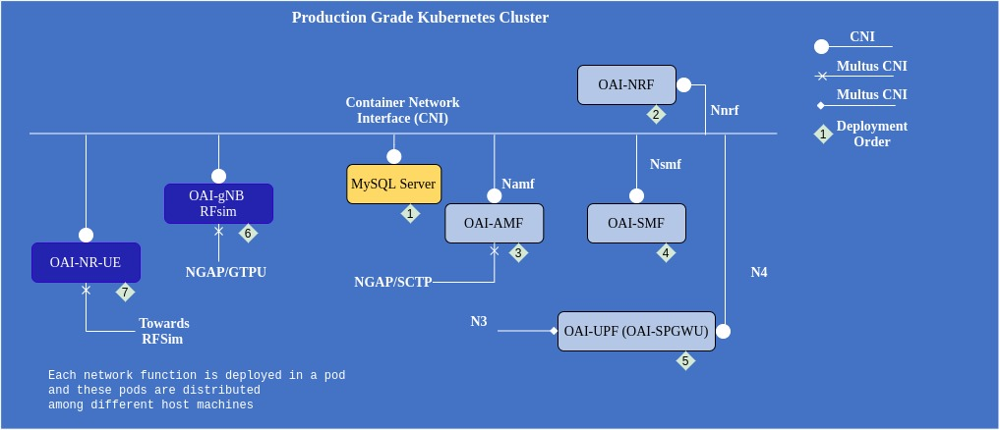

<table style="border-collapse: collapse; border: none;">
  <tr style="border-collapse: collapse; border: none;">
    <td style="border-collapse: collapse; border: none;">
      <a href="http://www.openairinterface.org/">
         
         </img>
      </a>
    </td>
    <td style="border-collapse: collapse; border: none; vertical-align: center;">
      <b><font size = "5">OpenAirInterface 5G Core Network Deployment using Helm Charts</font></b>
    </td>
  </tr>
</table>


The cloud native network functions in production will be deployed using a production grade container orchestrator like Openshift of customize Kubernetes. OAI 5g Core network is being designed to keep up with the latest cloud native deployment scenarios. Each network function will be deployed individually using its own helm chart. In this tutorial we will deploy MFCN (Minimalist Functional Core Network) Flavour of OAI 5GC. 




**Reading time: ~1hr**

**Tutorial replication time: ~1h30mins**


**Humble request**: Our tutorial and helm chart are based on Openshift (RH) cluster, the workloads and objects are tailored according to openshift security policies. Some of Openshift objects and APIs are not available in Kubernetes in that case read the last section of this tutorial to make the changes which are specific to Kubernetes. 


**TABLE OF CONTENTS**

1.  [Description](#1-description)
2.  [Building Images](#2-building-images)
3.  [Configuring Helm Charts](#3-configuring-helm-charts)
4.  [Deploying 5g Core Helm Charts](#4-deploying-helm-charts)
5.  [Optional: Testing with OAI gNB RFsimulator and NR-UE](#5-testing-with-oai-gnb-rfsimulator-and-nr-ue)
6.  [Changes for Vanila Kubernetes](#6-changes-for-vanila-kubernetes)


## 1. Description

The helm charts can be used on any production grade kubernetes cluster. In our lab we an Openshift cluster, the cluster information can be found below. We have also tested these charts on vanilla kubernetes.


|Software                        |Version                            |
|:-------------------------------|:----------------------------------|
|Openshift Client Version        |4.4.10                             |
|Kubernetes Version              |Kubernetes Version: v1.17.1+45f8ddb|
|helm                            |v3.5.3                             |
|Base images of Network functions|Ubuntu 18.04/UBI 8 (CoreOS RHEL)   |


### Pre-requisite

The cluster on which these helm charts will be deployed should have RBAC and [Multus CNI](https://github.com/k8snetworkplumbingwg/multus-cni). Multus is necessary to provide multiple interfaces to AMF and UPF/SPGWU. 

## 2. Building Images

The base image used by network function is dependent on the operating system it will be running on. If it is a debian (ubuntu) based cluster then base image will be ubuntu. If it is a RPM (core-os) based cluster then base images will UBI8. Follow the tutorial on [how to build images](./BUILD_IMAGES.md) depending on the cluster/worker-node operating system. 

In case of Ubuntu based worker nodes, the images can be pulled from [docker-hub](./RETRIEVE_OFFICIAL_IMAGES.md) but if you want to make some changes in the network function configuration which can not be changed using configuration parameters of helm chart then you should build the image. In case of RHEL based worker node you have to build your own images, to download packages from RHEL repository you need a developer or enterprise account.

## 3. Configuring Helm Charts

Clone the helm chart repository from gitlab repository

```
$ git clone https://gitlab.eurecom.fr/oai/cn5g/oai-cn5g-fed.git
$ cd charts
$ ls charts
mysql  oai-amf  oai-ausf oai-gnb  oai-nr-ue  oai-nrf  oai-smf  oai-spgwu-tiny oai-udm oai-udr 
```

Helm chart of every network function looks similar and has the below structure. Only the chart of mysql database is different and the NRF helm chart has an extra pvc.yaml to create a presistant volume for storing tcpdump.

```
Network_function/
├── Chart.yaml
├── templates
│             ├── configmap.yaml
│             ├── deployment.yaml
│             ├── _helpers.tpl
│             ├── multus.yaml
│             ├── NOTES.txt
│             ├── rbac.yaml
│             ├── serviceaccount.yaml
|             └── service.yaml
└── values.yaml 

1 directory, 10 files
```

All the configurable parameters for a particular commit/release are mentioned in the `values.yaml` file. These parameters will keep on changing in the future depending on the nature of development and features.

Depending on the namespace where these charts will be instantiated change the value of `namespace` parameter in `values.yaml`. All the network function related configurable parameters are in the sections `config` of the `values.yaml`. To understand the usage and description of each network function configuration parameter refer their [wiki page](https://gitlab.eurecom.fr/oai/cn5g/oai-cn5g-amf/-/wikis/home).

Create a namespace where the helm-charts will be deployed, in our environment we deploy them in `oai` namespace. To create a namespace use the below command on your cluster, 

```bash
# needs a user which has the right to create namespaces
$ kubectl create ns oai
$ kubectl config set-context --current --namespace=oai   #only needed in kubernetes
or 
$ oc new-project oai
```

**NOTE**: 
- If there is a need to edit a specific configuration parameter that is not configurable via the helm-chart values.yaml file then it has to be changed at the time of building images.
- Helm charts of all the network functions are properly configured to work directly with OAI-gNB and OAI-nr-ue charts which are present in this repository. 

### 3.1 Pulling Images

In case of pulling images from docker-hub it will be good to configure an image pull secrete because of the recent limit of 100 pulls in docker-hub from an anonymous account. If you provide a personal/company account the limit is different. In case if you want to provide a secrete configure this section in every helm chart `values.yaml`

```bash
#kubernetes
kubectl create secret docker-registry personalkey --docker-server=https://index.docker.io/v1/ --docker-username=<your-name> --docker-password=<your-pword> --docker-email=<your-email>
#openshift 
oc create secret docker-registry personalkey --docker-server=https://index.docker.io/v1/ --docker-username=<your-name> --docker-password=<your-pword> --docker-email=<your-email>

```

There are more ways to make docker secrete you can follow this [link](https://kubernetes.io/docs/tasks/configure-pod-container/pull-image-private-registry/). After this mention this in the `values.yaml` of each network function

```
## good to use when pulling images from docker-hub
imagePullSecrets: ['personalkey']
```

In this tutorial we are using below images 

|Network Function|Docker image name:tag            |
|:---------------|:--------------------------------|
|OAI-AMF         |rdefosseoai/oai-amf:v1.1.0       |
|OAI-SMF         |rdefosseoai/oai-smf:develop      |
|OAI-NRF         |rdefosseoai/oai-nrf:v1.1.0       |
|OAI-SPGWU-TINY  |rdefosseoai/oai-spgwu-tiny:v1.1.2|
|OAI-gNB         |rdefosseoai/oai-gnb:develop      |
|OAI-nr-ue       |rdefosseoai/oai-nr-ue:develop    |
|mysql           |mysql:5.7.30                     |


### 3.2 Networking related information

Network functions communicate based on **kubernetes service concept**, the network functions are using service name/FQDN of other network functions to use their service. 

*For example: AMF registers with NRF using NRF FQDN (`oai-nrf-svc.oai.svc.cluster.local`). This way we can get rid of any static ip-address configuration. Though we are still keeping the fields where we are mentioning ip-addresses for example `nrfIpv4Addr` in amf values.yaml but that is not being used if `USE_FQDN_DNS` is set to `true`*

#### 3.2.1 Production grade deployment (Multiple interfaces)

- Here the network functions will use different ethernet interfaces to bind their different interface. Example AMF communicates with gNB using N2 and with SMF and NRF using Namf. 
- To make the above seperation we are using multus to provide multiple ethernet interfaces to network functions which have multiple communication interfaces.
- Only AMF, SMF and UPF have the possiblity to use multus
- To configure multus for AMF, SMF or UPF, in `values.yaml` of each network function edit the multus section.

```
## Example from ../charts/oai-amf/values.yaml
multus:
  create: true
  n1IPadd: "<provide-an-ip-address>"
  n1Netmask: "<provide-a-netmask>"
  n1Gateway: "<Gateway>"
```

#### 3.2.2 Non-Production grade deployment (Single interface)

- No need to configure multus for any network function. For different communication interfaces network functions will use same ethernet interface. Example AMF will use `eth0` interface to communicate with gNB, SMF and NRF.
- In `values.yaml` of AMF, SMF and UPF in multus section do multus.create `false` like below, 

```
## Example from ../charts/oai-amf/values.yaml
multus:
  create: false (change only this)
```

#### 3.2.3 Taking TCP dump

Every network function has an extra TCP dump container to take the TCP dump, but by default this container start in sleep mode and doesn't capture the dumps on any interface. If enabled it will capture dumps on `all interfaces` and will store inside the container locally or in a persistant volume if enabled. 

To enable the persistant volume in the `values.yaml` of every network function make the below change, 

```
## in case of nrf but it same for every network function
start:
  nrf: start
  tcpdump: start #start tcpdump collection to analyse but beware it will take a lot of space in the container/persistent volume

persistence:
  sharedvolume: true
  volumneName: <configure-your-storage-name>
  size: <configure-the-size> #example 1Gi

```


### 3.3 Configuring AMF

Open the [values.yaml](../charts/oai-amf/values.yaml) to configure the required parameters. There are many parameters which can be configured. Below are some important parameters,  

```
namespace: "oai"

nfimage:
  registry: local
  repository: rdefosseoai/oai-amf # image name either locally present or in a public/private repository
  version: develop # image tag
  # pullPolicy: IfNotPresent or Never or Always
  pullPolicy: Always

tcpdumpimage:
  registry: local
  repository: corfr/tcpdump
  version: latest
  #pullPolicy: IfNotPresent or Never or Always
  pullPolicy: Always

# configure these values based on gNB/emulator configuration
config: 
  mcc: "208"
  mnc: "95"
  regionId: "128"
  amfsetId: "1"
  servedGuamiMcc0: "208"
  servedGuamiMnc0: "95"
  servedGuamiRegionId0: "128"
  servedGuamiAmfSetId0: "1"
  servedGuamiMcc1: "460"
  servedGuamiMnc1: "11"
  servedGuamiRegionId1: "10"
  servedGuamiAmfSetId1: "1"
  plmnSupportMcc: "208"
  plmnSupportMnc: "95"
  plmnSupportTac: "0x0001"
  sst0: "1"
  sd0: "1"
  sst1: "111"
  sd1: "124"
```

The mysql database is pre-configured with some subscriber information. If there is new subscriber information then it should be configured in the mysql database. The subscriber PLMN information should match with gNB and AMF. 

```
  mySqlServer: "mysql"
  mySqlUser: "root"
  mySqlPass: "linux"
  mySqlDb: "oai_db"
  operatorKey: "63bfa50ee6523365ff14c1f45f88737d" (should be the same in mysql)
```

By default `readinessProbe` and `livenessProbe` are `true` to disable them change the value with `false`

There are more parametes which can be configured like extra interfaces and resource usage by network function, please refer [values.yaml](../charts/oai-amf/values.yaml). Infront of every parameter there is a comment.

### 3.4 Configuring SMF

Open [values.yaml](../charts/oai-smf/values.yaml) to configure SMF configuration. DNS configuration which will be shared with the UE based on the DNS used in your environment, it can be 8.8.8.8 or 4.4.4.4 if you don't know your DNS. 

```
namespace: "oai" # namespace where SMF will be deployed 

nfimage:
  registry: local
  repository: rdefosseoai/oai-smf
  version: develop
  #pullPolicy: IfNotPresent or Never or Always
  pullPolicy: Always

tcpdumpimage:
  registry: local
  repository: corfr/tcpdump
  version: latest
  #pullPolicy: IfNotPresent or Never or Always
  pullPolicy: Always

config:
  dnsIpv4Address: ""
  dnsSecIpv4Address: ""
```

Currenly DNN related information and UE network related information can only be changed at the time of building the SMF network function. Refer [Configure the Containers](./CONFIGURE_CONTAINERS.md) to understand how it can be done. 

Configure `readinessProbe` and `livenessProbe` by default they are `true` to switch them off change the value with `false`

There are more parametes which can be configured like extra interfaces and resource usage by network function, please refer [values.yaml](../charts/oai-smf/values.yaml). Infront of every parameter there is a comment. 

### 3.5 Configuring UPF

Open [values.yaml](../charts/oai-spgwu-tiny/values.yaml) to configure UPF/SPGWU configuration

```
namespace: "oai" # namespace where SMF will be deployed 

nfimage:
  registry: local
  repository: rdefosseoai/oai-spgwu-tiny
  version: develop
  # pullPolicy: IfNotPresent or Never or Always
  pullPolicy: Always

tcpdumpimage:
  registry: local
  repository: corfr/tcpdump
  version: latest
  #pullPolicy: IfNotPresent or Never or Always
  pullPolicy: Always

config:
  gwId: 1
  mnc: 208 # should match with AMF and SMF and gNB information
  mcc: 95 # should match with AMF and SMF and gNB information
  realm: "3gpp.org" 
  pidDirectory: "/var/run"
```

Configure `readinessProbe` and `livenessProbe` by default they are `true` to switch them off change the value with `false`

There are more parametes which can be configured like extra interfaces and resource usage by network function, please refer [values.yaml](../charts/oai-spgwu-tiny/values.yaml). Infront of every parameter there is a comment. 

### 3.6 Configuring NRF

NRF configuration is straight forward, most of configurable parameters have comment infront of it for explaination. Refer the [values.yaml](../charts/oai-nrf/values.yaml)

```
namespace: "oai"

# NF image
nfimage:
  registry: local
  repository: rdefosseoai/oai-nrf
  version: develop
  # pullPolicy: IfNotPresent or Never or Always
  pullPolicy: Always

tcpdumpimage:
  registry: local
  repository: corfr/tcpdump
  version: latest
  # pullPolicy: IfNotPresent or Never or Always
  pullPolicy: Always
```

Configure `readinessProbe` and `livenessProbe` by default they are `true` to switch them off change the value with `false`

### 3.7 Configuring subscriber data in MYSQL

Currently the MYSQL is configured with below subscriber data,

```
IMSI - 208950000000030-34
IMEI - 55000000000001
Secret Key (K) - 0x0C0A34601D4F07677303652C0462535B
OPc - 0x63bfa50ee6523365ff14c1f45f88737d
```

To configure new subscriber add a new entry in [values.yaml](../charts/mysql/values.yaml) line 345, add a new entry after 

```
INSERT INTO `users` VALUES (imsi,'380561234567',imei,NULL,'PURGED',50,40000000,100000000,47,0000000000,1,0xkey,0,0,0x40,'ebd07771ace8677a',0xOpC);
```

In above statement change `imsi`, `imei`, `key` and `opc` with appropriate value according to your environment. 

**NOTE**: Mysql Helm-chart by default makes a persistent volumne claim, make sure that there is a storage class. If not then you can disable the persistant volume using `persistant` key as `false`.

## 4. Deploying Helm Charts

**NOTE**: Use only `helm3` not `helm2`, if you want to use `helm2` then you have to provide `--namespace` or `-n` while using `helm` command

Helm charts have an order of deployment for the proper configuration of core network. 

`mysql --> nrf --> amf --> smf --> upf(spgwu)`

Once the configuration is finished the charts can be deployed with a user who has the rights to

1. Create RBAC
2. Run pod with privileged and anyuid scc
3. Create multus binds

```
$ helm install mysql mysql/
# wait for the pod to be ready 
$ helm install nrf oai-nrf/
# wait for the pod to be ready 
$ helm install amf oai-amf/
# wait for the pod to be ready 
$ helm install smf oai-smf/
# wait for the pod to be ready 
$ helm install upf oai-spgwu-tiny/
# wait for the pod to be ready 
$ helm list 
NAME  NAMESPACE       REVISION  UPDATED                                   STATUS    CHART                 APP VERSION
amf   oai             1         2021-09-08 09:49:34.121156906 +0200 CEST  deployed  oai-amf-1.1.0         1.1.0      
mysql oai             1         2021-09-07 13:51:35.719196632 +0200 CEST  deployed  mysql-1.6.9           5.7.30     
nrf   oai             1         2021-09-08 09:48:55.880603218 +0200 CEST  deployed  oai-nrf-1.1.0         1.1.0      
smf   oai             1         2021-09-08 09:50:50.944575884 +0200 CEST  deployed  oai-smf-1.1.0         1.1.0      
spgwu oai             1         2021-09-08 09:57:20.805848479 +0200 CEST  deployed  oai-spgwu-tiny-1.1.2  1.1.2   
$ kubectl get pods
NAME                              READY   STATUS    RESTARTS   AGE
mysql-56b9b5db49-5jl2d            1/1     Running   0          21h
oai-amf-86b455894f-qfs4l          2/2     Running   0          66m
oai-nrf-7f6ffbb799-w5nr5          2/2     Running   0          66m
oai-smf-66bd4797f9-qpp2g          2/2     Running   0          64m
oai-spgwu-tiny-676bc47467-pbjn6   2/2     Running   0          58m

```

## 4.1 How to check if the Core network is properly configured? 

Check the logs `smf` and `upf` to see that the PFCP session is properly configured, 

```
$ kubectl oai-smf-678bbc965f-whdr6 smf | grep 'Received N4 ASSOCIATION SETUP RESPONSE from an UPF'
[2021-08-02T14:52:57.695110] [smf] [smf_n4 ] [info ] Received N4 ASSOCIATION SETUP RESPONSE from an UPF
$ kubectl logs oai-spgwu-tiny-6c4d68fd45-mpv5v spgwu | grep 'Received SX HEARTBEAT REQUEST' | wc -l
60 (should be more than 1)
```

This will verify that `smf` and `upf` have successfully registered to `nrf` and there is a PFCP session. 

Now go ahead and use OAI-gNB/dsTest/gNBSIM or any other gNB or emulator to test the deployed core network.


## 5 Testing with OAI gNB RFsimulator and NR-UE



The images which are used in the tutorial are already present in docker-hub like the other images of OAI 5g core network functions. The charts of all the network functions are preconfigured to work with OAI-gnB and OAI-NR-UE end to end installation. 

Currently via the helm charts of OAI-gNB in RFsimulator mode there aren't many parameters which are configurable, in the future we will edit this list. But in case if you want to make some parameter configurable which is not possible via the chart then that can be done at the time of building the image of running the network function in sleep mode and then editing the conf file manually by going inside the pod/container. 


### 5.1 Images OAI-gNB RFSimulator and OAI-NR-UE

For ubuntu based worked nodes the images can be pulled directly from docker-hub but in case of openshift based worker nodes you have build the images manually. To build images follow this [link](https://gitlab.eurecom.fr/oai/openairinterface5g/-/tree/develop/docker)


### 5.2 Configuring OAI-gNB RFSimulator and OAI-NR-UE

**Very Important** To access internet in NR-UE the DN/SGI interface of UPF/SPGWU should be able access the internet. 

OAI-gNB has to be configured with static ip-address because in the configuration file the interface ip-address has to be mentioned. In our environment  the default CNI we can not provide static ip-addresses, so we are using multus cni to provide an extra interface and static ip-address. In case you are using calico in your environment you can provide static ip-address to `eth0` interface. 

```
## oai-gNB configuration from values.yaml

multus:    # needed when gnB service will run on another interface rather than traditional eth0 the same interface will be used for ngap and n3
  create: true
  ipadd: "<configure-an-ip-address>"
  netmask: "<configure-netmask>"
  hostInterface: "<parent-host-interface-for-macvlan>"
  gateway: "<Gateway>"

config:
  timeZone: "Europe/Paris"
  rfSimulator: "server" 
  useSATddMono: "yes"
  gnbName: "gnb-rfsim"
  mcc: "208"   # check the information with AMF, SMF, UPF/SPGWU
  mnc: "95"    # check the information with AMF, SMF, UPF/SPGWU
  mncLength: "2" # check the information with AMF, SMF, UPF/SPGWU
  tac: "1"     # check the information with AMF
  nssaiSst: "1"  #currently only 4 standard values are allowed 1,2,3,4 make sure same values are present in AMF, SMF and SPGWU
  nssaiSd0: "1"    #values in hexa-decimal format
  nssaiSd1: "112233"  
  amfIpAddress: "<ip-address-of-amf>"  # amf ip-address currently we can not provide the amf service name to be used by gNB
  gnbNgaIfName: "<interface-name-for-ngap>"   #ngap interface eth0 or net1
  gnbNgaIpAddress: "<ip-address-of-ngap-interface>" gNB ip-address allocated to gnbNga interface
  gnbNguIfName: "<interface-name-for-n3-gtpu>"   #n3 gtu interface for upf/spgwu 
  gnbNguIpAddress: <ip-address-of-n3-gtpu-interface> gNB ip-address allocated to gnbNgu interface
  useAdditionalOptions: "--sa -E --rfsim" # don't change unless you know the setting
``` 

In our environment we also need to provide multus interface for `oai-nr-ue` so that it can be on the same network as of `oai-gnb`

```
## oai-nr-ue configuration from values.yaml
multus:
  create: true
  ipadd: <configure-an-ip-address>
  netmask: <configure-netmask>
  hostInterface: <parent-host-interface-for-macvlan>
  gateway: <Gateway>

config:
  timeZone: "Europe/Paris"
  rfSimulator: "<ip-address-of-gnb>"    # ip-address of gnb rf-sim
  fullImsi: "208950000000031"       # make sure all the below entries are present in the subscriber database
  fullKey: "0C0A34601D4F07677303652C0462535B" 
  opc: "63bfa50ee6523365ff14c1f45f88737d"
  dnn: "oai" 
  nssaiSst: "1"                     # configure according to gnb and amf, smf and upf 
  nssaiSd: "1"                       
  useAdditionalOptions: "-E --sa --rfsim -r 106 --numerology 1 -C 3619200000 --nokrnmod"  # don't change unless you know
```

### 5.3 Deploy OAI-gNB RFSimulator and OAI-NR-UE

Order of helm-chart deployement once the 5g core network helm charts are already deployed. 

```
oai-gnb --> oai-nr-ue
```

Now install oai-gnb and wait, 

```
$ helm install gnb oai-gnb/
```
Wait for it to be ready and once ready check the logs oai-amf that gnB is connected using the below command

```
kubectl logs -c amf <oai-amf-pod-name> | grep Connected | grep gnb-rfsim | wc -l
```
If the above value is `1` or more than that then gNB is connected else there is a problem or wait for couple of seconds. 

Now install oai-nr-ue and wait for it to be ready,

```
$ helm install nrue oai-nr-ue/
```

```
$ helm list
NAME  NAMESPACE       REVISION  UPDATED                                   STATUS    CHART                 APP VERSION
amf   oai             1         2021-09-08 09:49:34.121156906 +0200 CEST  deployed  oai-amf-1.1.0         1.1.0      
gnb   oai             1         2021-09-08 10:44:02.558631345 +0200 CEST  deployed  oai-gnb-0.1.1         v1         
mysql oai             1         2021-09-07 13:51:35.719196632 +0200 CEST  deployed  mysql-1.6.9           5.7.30     
nrf   oai             1         2021-09-08 09:48:55.880603218 +0200 CEST  deployed  oai-nrf-1.1.0         1.1.0      
nrue  oai             1         2021-09-08 10:44:44.622763587 +0200 CEST  deployed  oai-nr-ue-0.1.1       v1         
smf   oai             1         2021-09-08 09:50:50.944575884 +0200 CEST  deployed  oai-smf-1.1.0         1.1.0      
spgwu oai             1         2021-09-08 09:57:20.805848479 +0200 CEST  deployed  oai-spgwu-tiny-1.1.2  1.1.2   

$ kubectl get pods
NAME                              READY   STATUS    RESTARTS   AGE
mysql-56b9b5db49-5jl2d            1/1     Running   0          21h
oai-amf-86b455894f-qfs4l          2/2     Running   0          66m
oai-gnb-79f46cbb85-rs5wc          3/3     Running   0          11m
oai-nr-ue-6dd669d78f-ktttg        2/2     Running   0          10m
oai-nrf-7f6ffbb799-w5nr5          2/2     Running   0          66m
oai-smf-66bd4797f9-qpp2g          2/2     Running   0          64m
oai-spgwu-tiny-676bc47467-pbjn6   2/2     Running   0          58m
```

Checking `amf` logs if the UE is connected properly

```bash
kubectl logs oai-amf-86b455894f-qfs4l amf | grep 5GMM-REGISTERED | wc -l 
```

If more than `1` then everything is good. 

Once the setup is configured properly and everything is configured correctly open a terminal inside oai-nr-ue pod and try to ping towards internet to see and end to end setup. To understand how to do an end to end log analysis or pcap analysis follow this [tutorial](./DEPLOY_5G_CORE.md)


```bash
$ oc rsh -c nr-ue oai-nr-ue-6dd669d78f-ktttg
or 
$ kubectl exec -it nr-ue oai-nr-ue-6dd669d78f-ktttg bash

$ route -n 
sh-4.4# route -n
Kernel IP routing table
Destination     Gateway         Genmask         Flags Metric Ref    Use Iface
0.0.0.0         192.168.18.129  0.0.0.0         UG    0      0        0 net1
10.128.0.0      0.0.0.0         255.252.0.0     U     0      0        0 eth0
10.130.4.0      0.0.0.0         255.255.254.0   U     0      0        0 eth0
12.1.1.0        0.0.0.0         255.255.255.0   U     0      0        0 oaitun_ue1
172.30.0.0      10.130.4.1      255.255.0.0     UG    0      0        0 eth0
192.168.18.0    0.0.0.0         255.255.255.0   U     0      0        0 net1
224.0.0.0       0.0.0.0         240.0.0.0       U     0      0        0 eth0

$ ping -I oaitun_ue1 -c4 google.fr 
PING google.fr (172.217.19.131) 56(84) bytes of data.
64 bytes from par03s12-in-f131.1e100.net (172.217.19.131): icmp_seq=1 ttl=116 time=27.4 ms
64 bytes from par03s12-in-f131.1e100.net (172.217.19.131): icmp_seq=2 ttl=116 time=12.5 ms
64 bytes from par03s12-in-f131.1e100.net (172.217.19.131): icmp_seq=3 ttl=116 time=16.5 ms
64 bytes from par03s12-in-f131.1e100.net (172.217.19.131): icmp_seq=4 ttl=116 time=29.0 ms

--- google.fr ping statistics ---
4 packets transmitted, 4 received, 0% packet loss, time 3003ms
rtt min/avg/max/mdev = 12.513/21.352/29.042/7.031 ms

## incase above doesn't work try with 8.8.8.8 instead of dns. If that works then probably you have't configure dns properly in SMF. 

## using non ue interface packet not traveling via core-network

$ ping -c4 google.fr 
PING google.fr (172.217.171.195) 56(84) bytes of data.
64 bytes from mrs09s06-in-f3.1e100.net (172.217.171.195): icmp_seq=1 ttl=116 time=2.90 ms
64 bytes from mrs09s06-in-f3.1e100.net (172.217.171.195): icmp_seq=2 ttl=116 time=2.99 ms
64 bytes from mrs09s06-in-f3.1e100.net (172.217.171.195): icmp_seq=3 ttl=116 time=3.04 ms
64 bytes from mrs09s06-in-f3.1e100.net (172.217.171.195): icmp_seq=4 ttl=116 time=2.97 ms

--- google.fr ping statistics ---
4 packets transmitted, 4 received, 0% packet loss, time 3005ms
rtt min/avg/max/mdev = 2.899/2.974/3.043/0.051 ms

```

Observe the difference in two pings one goes directly towards internet via host networking and second travels through OAI stack. 

## 6. Changes for Vanila Kubernetes

All the OAI containers run the the network function process as they are route inside the container in the docker engine this not a problem because by default user is root inside container. But incase of podman in openshift container run as non root user. Some containers like SPGWU, gnb and nr-ue they are privilaged container. In that case in `specs` of these pods the `privilaged` flag should be true. 

The only import change is related to `rbac.yaml` present in the `templates` folder of each helm-chart. Currently it is configured for openshift api group `security.openshift.io` but this doesn't exist in Kubernetes. Instead in kubernetes it should be changed with 

```
apiVersion: rbac.authorization.k8s.io/v1
kind: ClusterRole
metadata:
  name: {{ .Chart.Name }}-{{ .Values.namespace }}-role
rules:
- apiGroups:
  - ""
  resources:
  - pods
  - services
  - configmaps
  verbs:
  - get
  - watch
  - list
---
apiVersion: rbac.authorization.k8s.io/v1
kind: ClusterRoleBinding
metadata:
  name: {{ .Chart.Name }}-{{ .Values.namespace }}-binding
subjects:
- kind: ServiceAccount
  name: {{ .Values.serviceAccount.name }}
  namespace: {{ .Values.namespace }}
roleRef:
  kind: ClusterRole
  name: {{ .Chart.Name }}-{{ .Values.namespace }}-role
  apiGroup: rbac.authorization.k8s.io
```

## 7. Demo video

## 8. Bonus 

- If you want to use only one interface but still would like to expose a service endpoint of a network function then you can use the LoadBalancer service of the cloud provider/Kubernetes/Openshift. Instead of NodePort or ClusterIP. 
- Static ip-address allocation in [calico]() 
