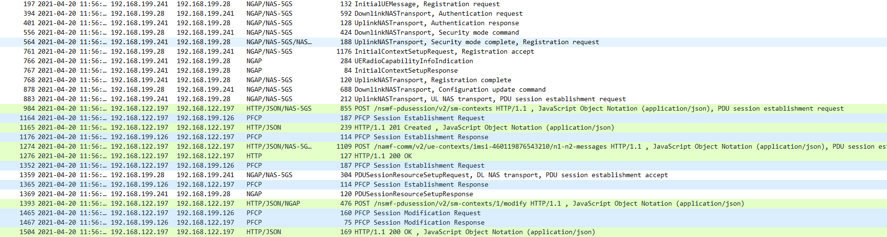

<table style="border-collapse: collapse; border: none;">
  <tr style="border-collapse: collapse; border: none;">
    <td style="border-collapse: collapse; border: none;">
      <a href="http://www.openairinterface.org/">
         
         </img>
      </a>
    </td>
    <td style="border-collapse: collapse; border: none; vertical-align: center;">
      <b><font size = "5">OpenAirInterface 5G Core Network Deployment in Virtual Machines and Testing with COTSUE</font></b>
    </td>
  </tr>
</table>


**TABLE OF CONTENTS**

1.  [Description](#1-description)
2.  [Pre-requisites](#2-pre-requisites)
3.  [Creating Virtual Machines](#3-creating-virtual-machines)
4.  [Building Network Functions](#4-building-network-functions)
5.  [Configuring Network Functions](#5-configuring-network-functions)
6.  [Starting Network Functions](#6-starting-network-functions)
7.  [Analysing Results](#7-analyzing-the-results)
8.  [Demo Video](#8-demo-video)


## 1. Description

This tutorial shows how to use OAI 5g Core network in standalone deployment with commercial gNB and COTS UE. The tutorial and testbed was made by [OpenXG group](http://www.opensource5g.org) located in BUPT, Beijing.

- The core network is deployed in two Virtual Machines
- The commercial gNB used for this tutorial is Amarisoft
- The COTS UE used for this tutorial is Xiaomi K30i
- [Openair-spgwu-tiny](https://github.com/OPENAIRINTERFACE/openair-spgwu-tiny/tree/gtp_extension_header) is choosen as the UPF for this tutorial
- Subscriber database is running as a process inside 5G CCP-VM

## 2. Pre-requisites

The host machine hosting the virtual machines have the below configuration:

| Params |                   Value |
| :----- | ----------------------: |
| CPU    | Intel Core i9-9980HK 16 |
| Memory |                   32 GB |
| Disk   |              512 GB SSD |
| System |            Ubuntu 18.04 |

The virtual machines are configured using KVM, though any other virtual machine manager can be used. To install KVM and virt-manager follow the below commands:

```bash=
~$ sudo apt-get install qemu-kvm
~$ sudo apt-get install qemu
~$ sudo apt-get install virt-manager
~$ sudo apt-get install virt-viewer 
~$ sudo apt-get install libvirt-bin 
~$ sudo apt-get install bridge-utils
```

Verify the installation:

```bash=shell
~$ sudo kvm-ok
```

If everything is ok, you would see

```bash=shell
INFO: /dev/kvm exists
KVM acceleration can be used
```

Create virtual machines by using virt-manager GUI:

 ```bash=shell
~$ sudo virt-manager
 ```

## 3. Creating Virtual Machines

Recommendation is to create two VMs with 4 Cores, 8GB memory, 40GB disk. First one for 5G Core control plane 5G-CCP, and the second for 5G User plane 5G-UP. 

Network configuration for both the VMs

- 5G-CCP VM

| NIC  |    Network Source | IP address      | Usage |
| ---- | ----------------: | :-------------- | ----: |
| ens3 |               NAT | 192.168.122.197 |   SBI |
| ens9 | Bridge to Phy NIC | 192.168.199.28  |  NGAP |

- 5G-UP VM

| NIC   | Network Source    |      IP address |  Usage |
| ----- | :---------------- | --------------: | -----: |
| ens9  | NAT               |  192.168.122.78 |     N4 |
| ens10 | NAT               |  192.168.122.55 | N6/SGi |
| ens12 | Bridge to Phy NIC | 192.168.199.126 |     N3 |

## 4. Building Network functions

The branch commits used at the time of the demo are listed below:

| NF Name |          Branch Name | Commit                                   |
| ------- | -------------------: | :--------------------------------------- |
| AMF     |             develop | aca0000239dda24fb115c54677060f3da8ca6e54 |
| SMF     |              develop | 2a0dd9c810a322e11ff81b415807fd246e4a9b67 |
| SPGW-U-TINY  | gtp_extension_header | f13f4a5e2807355d23f136119f85fbf48ed569ea |


### 4.1 Build AMF

- Login to 5G-CCP VM and open the terminal to fetch, build and install the AMF. 
- The build can be made in two modes Debug and Release. Debug mode will provide more logs for debuging but may effect the performance. 
- To read more about amf build [checkout](https://gitlab.eurecom.fr/oai/cn5g/oai-cn5g-amf/-/wikis/home) 

``` bash=
~$ git clone -b bupt_amf https://gitlab.eurecom.fr/oai/cn5g/oai-cn5g-amf.git
~$ cd ./oai-cn5g-amf/
~$ cd ./build/scripts/
~$ sudo ./build_amf --install-deps --force
~$ sudo ./build_amf --clean --Verbose --build-type Debug --jobs
```

### 4.2 Build SMF

- Remain logged in to the same virtual machine to compile and install SMF
- The build can be made in two modes Debug and Release. Debug mode will provide more logs for debuging but may effect the performance.
- To read more about smf build [checkout](https://gitlab.eurecom.fr/oai/cn5g/oai-cn5g-smf/-/wikis/home) 

``` bash=
~$ git clone -b develop https://gitlab.eurecom.fr/oai/cn5g/oai-cn5g-smf.git
~$ cd ./oai-cn5g-smf/
~$ cd ./build/scripts/
~$ sudo ./build_smf --install-deps --force
~$ sudo ./build_smf--clean --Verbose --build-type Debug --jobs
```

### 4.3 Build SPGWU

- Login to 5G-UP VM and open a terminal to fetch, build and install SPGWU
- The build can be made in two modes Debug and Release. Debug mode will provide more logs for debuging but may effect the performance.

``` bash= 
~$ git clone -b gtp_extension_header https://github.com/OPENAIRINTERFACE/openair-spgwu-tiny.git
~$ cd ./openair-spgwu-tiny/
~$ sudo apt-get update && DEBIAN_FRONTEND=noninteractive apt-get upgrade --yes && DEBIAN_FRONTEND=noninteractive apt-get install --yes \
    psmisc \
    net-tools \
    iproute2 \
    ethtool \
    iptables \
    tshark \
    libgoogle-glog0v5 \
    libdouble-conversion1 \
    libconfig++9v5 \
    libboost-system1.65.1 \
  && rm -rf /var/lib/apt/lists/*
~$ cd ./build/scripts/
~$ sudo ./build_spgwu --install-deps --force
~$ sudo ./build_spgwu --clean --build-type Debug --jobs --Verbose
```

## 5. Configuring Network Functions

### 5.1 AMF Configuration

- Install and configure MYSQL database in the 5G-CCP Virtual Machine with the [database file](https://gitlab.eurecom.fr/oai/cn5g/oai-cn5g-amf/-/blob/bupt_amf/etc/openxg.sql) 

- Configuration file used in setup can be find in the below link, it might differ with the one which is present in the current **develop branch**. For this case refer to the further points to understand the exact configuration changes which are important.  

| File Name |                 Repository |                                                     Location |
| --------- | -------------------------: | -----------------------------------------------------------: |
| amf.conf  | (Gitlab) cn5g/oai-cn5g-amf | [etc/successful.conf/amf.conf](https://gitlab.eurecom.fr/oai/cn5g/oai-cn5g-amf/-/blob/bupt_amf/etc/successful.conf/amf.conf) |

- MCC, MNC and TAC configured according to the SIM card, it will change based on the subscriber information

```
MCC = "460"  #Mobile Country Code
MNC = "11"   #Mobile Network Code
TAC = 100    #Type Allocation Code 
SST = "1"    #Slice and service type of S-NSSAI
SD  = "none" #S-NSSAI parameter slice, composition of service type and slice component
```

- Network interface configuration for AMF based on the interfaces configured for 5G-CCP virtual machine

```
  INTERFACES:
  {
    # AMF binded interface for N1/N2 interface (NGAP) 
    NGAP_AMF: 
    {
      INTERFACE_NAME = "ens9";  # YOUR NETWORK CONFIG HERE
      IPV4_ADDRESS   = "read";
      PORT           = 38412;                            # YOUR NETWORK CONFIG HERE
      PPID           = 60;                               # YOUR NETWORK CONFIG HERE
    };
    
    # AMF binded interface for SBI (N11 (SMF)/N12 (AUSF), etc.)
    N11:
    {
      INTERFACE_NAME = "ens3";                           # YOUR NETWORK CONFIG HERE
      IPV4_ADDRESS   = "read"; 
      PORT           = 8282;                             # YOUR NETWORK CONFIG HERE
      API_VERSION    = "v1"; 
      
      SMF_INSTANCES_POOL = (
        {SMF_INSTANCE_ID = 1; IPV4_ADDRESS = "192.168.122.197"; PORT = "8889"; VERSION = "v2"; SELECTED = "true"},   # YOUR SMF CONFIG HERE
        {SMF_INSTANCE_ID = 2; IPV4_ADDRESS = "192.168.122.2"; PORT = "80"; VERSION = "v1"; SELECTED = "false"} # YOUR SMF CONFIG HERE
      );
    };
  };
```

- NGAP_AMF interface configuration

```
INTEFACE_NAME: Interface name of AMF which connects to gNB
PORT: Port number which connects to gNB
```

- N11 interface configuration

```
INTERFACE_NAME: Interface name of AMF which connects to SMF
PORT: Port number which connects to SMF
IPV4_ADDRESS: SMF IP address
SELECTED: true/false indicate whether SMF is selected or not
```

- AMF DATABASE configuration

```
  AUTHENTICATION:
  {
    ## MySQL mandatory options
    MYSQL_server = "127.0.0.1"; # MySQL Server address
    MYSQL_user   = "root";   # Database server login
    MYSQL_pass   = "linux";   # Database server password
    MYSQL_db     = "OPENXG_DB";     # Your database name
    
    ## OP
    OPERATOR_key = "63bfa50ee6523365ff14c1f45f88737d"; # OP key matching your database
    RANDOM = "true";
  };
```

### 5.2 SMF Configuration

- Configuration file used in setup can be find in the below link, it might differ with the one which is present in the current **develop branch**. For this case refer to the further points to understand the exact configuration changes which are important.  

| File Name |                 Repository |                                                     Location |
| --------- | -------------------------: | -----------------------------------------------------------: |
| smf.conf  | (Gitlab) cn5g/oai-cn5g-amf | [etc/successful.conf/smf.conf](https://gitlab.eurecom.fr/oai/cn5g/oai-cn5g-amf/-/blob/bupt_amf/etc/successful.conf/smf.conf) |

- Network interface configuration for SMF based on the interfaces configured for 5G-CCP virtual machine

```
    INTERFACES :
    {
        N4 :
        {
            # SMF binded interface for N4 communication (UPF)
            INTERFACE_NAME = "ens3"; # YOUR NETWORK CONFIG HERE
            IPV4_ADDRESS   = "read";                        
         };

        SBI :
        {
            # SMF binded interface for SBI interface (e.g., communication with AMF, UDM)
            INTERFACE_NAME = "ens3";     # YOUR NETWORK CONFIG HERE
            IPV4_ADDRESS   = "read";
            PORT           = 8889;       # YOUR NETWORK CONFIG HERE (default: 80)
            HTTP2_PORT     = 8890; # YOUR NETWORK CONFIG HERE
            API_VERSION    = "v2";                # YOUR SMF API VERSION CONFIG HERE
         };                 

    };
```

- The DNN configuration is based on the UE configuration these values should match with the UE

```
    DNN_LIST = (
       # IPV4_POOL, IPV6_POOL are index in IPV4_LIST, IPV6_LIST, PDU_SESSION_TYPE choice in {IPv4, IPv6, IPv4v6}
      {DNN_NI = "IMS"; PDU_SESSION_TYPE = "IPv4v6"; IPV4_POOL  = 0; IPV6_POOL = 0},
      {DNN_NI = "ctnet"; PDU_SESSION_TYPE = "IPv4v6"; IPV4_POOL = 2; IPV6_POOL = 1},
      {DNN_NI = "apn2"; PDU_SESSION_TYPE = "IPv4"; IPV4_POOL = 1; IPV6_POOL = -1},
      {DNN_NI = "apn3"; PDU_SESSION_TYPE = "IPv4"; IPV4_POOL = 3; IPV6_POOL = -1},
      {DNN_NI = "apn4"; PDU_SESSION_TYPE = "IPv4"; IPV4_POOL = 4; IPV6_POOL = -1}
    );
```

- Field explanation.

```
DNN_NI : DNN name which smf will support
PDU_SESSION_TYPE : IPv4/IPv4v6, this corresponds to the session type requested by UE
IPV4_POOL/IPV6_POOL : Above this location in the configuration file, select the IP pool assigned to UE by serial number. If not support IPv6 set IPV6_POOL to '-1'.
```

- AMF,UPF information, UDM and NRF were not used for this demo

```
    AMF :
    {
      IPV4_ADDRESS = "192.168.122.197";  # YOUR AMF CONFIG HERE
      PORT         = 8282;            # YOUR AMF CONFIG HERE (default: 80)
      API_VERSION  = "v2";   # YOUR AMF API VERSION FOR SBI CONFIG HERE
    };
    
    UDM :
    {
      IPV4_ADDRESS = "192.168.122.197";  # YOUR UDM CONFIG HERE
      PORT         = 8181;            # YOUR UDM CONFIG HERE (default: 80)
      API_VERSION  = "v2";   # YOUR UDM API VERSION FOR SBI CONFIG HERE
    };    

    NRF :
    {
      IPV4_ADDRESS = "192.168.12.100";  # YOUR NRF CONFIG HERE
      PORT         = 80;            # YOUR NRF CONFIG HERE (default: 80)
      API_VERSION  = "v1";   # YOUR NRF API VERSION FOR SBI CONFIG HERE
    };
        
    UPF_LIST = (
         {IPV4_ADDRESS = "192.168.199.126" ;}  # YOUR UPF CONFIG HERE
    ); 

```

- Configure some PDU session information and Qos parameter 

```
    LOCAL_CONFIGURATION :
    {
      USE_LOCAL_CONFIGURATION = "yes";
      SESSION_MANAGEMENT_SUBSCRIPTION_LIST = (
         { NSSAI_SST = 1, NSSAI_SD = "0", DNN = "IMS", DEFAULT_SESSION_TYPE = "IPV4V6", DEFAULT_SSC_MODE = 1, 
           QOS_PROFILE_5QI = 5, QOS_PROFILE_PRIORITY_LEVEL = 1, QOS_PROFILE_ARP_PRIORITY_LEVEL = 1, QOS_PROFILE_ARP_PREEMPTCAP = "NOT_PREEMPT", 
           QOS_PROFILE_ARP_PREEMPTVULN = "NOT_PREEMPTABLE", SESSION_AMBR_UL = "20Mbps", SESSION_AMBR_DL = "22Mbps"},
         { NSSAI_SST = 1; NSSAI_SD = "0", DNN = "ctnet", DEFAULT_SESSION_TYPE = "IPV4v6", DEFAULT_SSC_MODE = 1, 
           QOS_PROFILE_5QI = 9, QOS_PROFILE_PRIORITY_LEVEL = 1, QOS_PROFILE_ARP_PRIORITY_LEVEL = 1, QOS_PROFILE_ARP_PREEMPTCAP = "NOT_PREEMPT", 
           QOS_PROFILE_ARP_PREEMPTVULN = "NOT_PREEMPTABLE", SESSION_AMBR_UL = "1000Mbps", SESSION_AMBR_DL = "1100Mbps"}
        );                 
    }; 

```

### 5.3 SPGWU Configuration

| File Name   |                 Repository |                                                     Location |
| ----------- | -------------------------: | -----------------------------------------------------------: |
| spgw_u.conf | (Gitlab) cn5g/oai-cn5g-amf | [etc/successful.conf/spgw_u.conf](https://gitlab.eurecom.fr/oai/cn5g/oai-cn5g-amf/-/blob/bupt_amf/etc/successful.conf/spgw_u.conf) |

- S4, SX and SGI Network interface configuration
```
    INTERFACES :
    {
        S1U_S12_S4_UP :
        {
            # S-GW binded interface for S1-U communication (GTPV1-U) can be ethernet interface, virtual ethernet interface, we don't advise wireless interfaces
            INTERFACE_NAME         = "ens12";  # STRING, interface name, YOUR NETWORK CONFIG HERE
            IPV4_ADDRESS           = "read";                                    # STRING, CIDR or "read to let app read interface configured IP address
            #PORT                   = 2152;                                     # Default is 2152
            #SCHED_PARAMS :
            #{
                #CPU_ID       = 2;
                #SCHED_POLICY = "SCHED_FIFO"; # Values in { SCHED_OTHER, SCHED_IDLE, SCHED_BATCH, SCHED_FIFO, SCHED_RR }
                #SCHED_PRIORITY = 98;
            #};
        };
        SX :
        {
            # S/P-GW binded interface for SX communication
            INTERFACE_NAME         = "ens9"; # STRING, interface name
            IPV4_ADDRESS           = "read";                        # STRING, CIDR or "read" to let app read interface configured IP address
            #PORT                   = 8805;                         # Default is 8805
            #SCHED_PARAMS :
            #{
                #CPU_ID       = 1;
                #SCHED_POLICY = "SCHED_FIFO"; # Values in { SCHED_OTHER, SCHED_IDLE, SCHED_BATCH, SCHED_FIFO, SCHED_RR }
                #SCHED_PRIORITY = 95;
            #};
        };
        SGI :
        {
           # No config to set, the software will set the SGi interface to the interface used for the default route.
            INTERFACE_NAME         = "ens10"; # STRING, interface name or "default_gateway"
            IPV4_ADDRESS           = "read";                         # STRING, CIDR or "read" to let app read interface configured IP address
            #SCHED_PARAMS :
            #{
                #CPU_ID       = 3;
                #SCHED_POLICY = "SCHED_FIFO"; # Values in { SCHED_OTHER, SCHED_IDLE, SCHED_BATCH, SCHED_FIFO, SCHED_RR }
                #SCHED_PRIORITY = 98;
            #};
        };
    };

```

- SMF network information

```
    SPGW-C_LIST = (
         {IPV4_ADDRESS="192.168.122.197" ;}
    );

```

- Slice configuration (NSSAI_SST,NSSAI_SD,DNN)

```
    UPF_INFO = (
         { NSSAI_SST = 1, NSSAI_SD = "0", DNN = "ims"},
         ##{ NSSAI_SST = 222; NSSAI_SD = "123", DNN = "ctnet"}
         { NSSAI_SST = 1; NSSAI_SD = "0", DNN = "ctnet"}
        );  
```

- No NRF is used in this demo so REGISTER_NRF variable should be set to **no**

### 5.4 Configuring SIM card and database

- User Subscprition Profile: The UE used in this demo and tutorial has  the below profile. If the user profile is different then the corresponding entry should be present in the mysql database. The database file is [OPENXG_DB.sql](https://gitlab.eurecom.fr/oai/cn5g/oai-cn5g-amf/-/blob/bupt_amf/etc/openxg.sql) 

  ```
  IMSI - 460110000000001
  IMEI - 35609204079301
  Secret Key (K) - 00112233445566778899AABBCCDDEEFF
  OPc - 000102030405060708090A0B0C0D0E0F
  ```

### 5.5 UE Configuration

- UE configuration.

  ```
  APN - ctnet
  MCC - 460
  MNC - 11
  APN Protocol - IPv4/IPv6
  Preferred network type - NR only
  ```

### 5.6 gNB Parameters

- MCC,MNC and TAC which the gNB should support.

  ```
  TAC - 0x64
  MCC - 460
  MNC - 11
  ```

## 6. Starting Network Functions

- Open two terminals on the host machine and login to 5G-CCP (AMF, SMF) and 5G-UP (SPGWU) virtual machines. Start taking pcaps at the respective interfaces to analyse them later. 
- Execute the below commands in the respected virtual machines. 

### 6.1 Start AMF

```bash=
~$ sudo amf -c /etc/openxg/amf.conf -o --no-ausf
[2021-04-20T11:56:06.526139] [AMF] [amf_app] [start] Options parsed!
[2021-04-20T11:56:06.526232] [AMF] [amf_app] [debug] 
Load AMF system configuration file(/etc/openxg/amf.conf)
[2021-04-20T11:56:06.526660] [AMF] [amf_app] [error] SettingNotFoundException : AMF.INTERFACES.NGAP_AMF.SCHED_PARAMS, using defaults
[2021-04-20T11:56:06.526716] [AMF] [amf_app] [error] SettingNotFoundException : AMF.INTERFACES.N11.SCHED_PARAMS, using defaults
[2021-04-20T11:56:06.526785] [AMF] [configurations] [info ] ======================    AMF   =====================
[2021-04-20T11:56:06.526798] [AMF] [configurations] [info ] Configuration AMF:
[2021-04-20T11:56:06.526804] [AMF] [configurations] [info ] - Instance ...........................................: 10
[2021-04-20T11:56:06.526809] [AMF] [configurations] [info ] - PID dir ............................................: /var/run
[2021-04-20T11:56:06.526814] [AMF] [configurations] [info ] - AMF NAME............................................: OAI-AMF
[2021-04-20T11:56:06.526818] [AMF] [configurations] [info ] - GUAMI (MCC, MNC, Region ID, AMF Set ID, AMF pointer): 
[2021-04-20T11:56:06.526823] [AMF] [configurations] [info ]    (460, 11, 128, 1, 1 )
[2021-04-20T11:56:06.526828] [AMF] [configurations] [info ] - SERVED_GUAMI_LIST...................................: 
[2021-04-20T11:56:06.526832] [AMF] [configurations] [info ]    (460, 11, 128 , 1, 1)
[2021-04-20T11:56:06.526837] [AMF] [configurations] [info ] - RELATIVE_CAPACITY...................................: 30
[2021-04-20T11:56:06.526841] [AMF] [configurations] [info ] - PLMN_SUPPORT_LIST...................................: 
[2021-04-20T11:56:06.526846] [AMF] [configurations] [info ]    (MCC 460, MNC 11) 
[2021-04-20T11:56:06.526850] [AMF] [configurations] [info ]    TAC: 100
[2021-04-20T11:56:06.526854] [AMF] [configurations] [info ]    SLICE_SUPPORT_LIST (SST, SD) ....................: 
[2021-04-20T11:56:06.526859] [AMF] [configurations] [info ]      (1, none) 
[2021-04-20T11:56:06.526863] [AMF] [configurations] [info ] - Emergency Support................... ...............: false
[2021-04-20T11:56:06.526892] [AMF] [configurations] [info ] - MYSQL Server Addr...................................: 127.0.0.1
[2021-04-20T11:56:06.526899] [AMF] [configurations] [info ] - MYSQL user .........................................: root
[2021-04-20T11:56:06.526904] [AMF] [configurations] [info ] - MYSQL pass .........................................: linux
[2021-04-20T11:56:06.526908] [AMF] [configurations] [info ] - MYSQL db ...........................................: OPENXG_DB
[2021-04-20T11:56:06.526912] [AMF] [configurations] [info ] - operator key .......................................: 63bfa50ee6523365ff14c1f45f88737d
[2021-04-20T11:56:06.526917] [AMF] [configurations] [info ] - random .............................................: true
```

### 6.2 Start SMF

```bash=
~$ sudo smf -c /etc/openxg/smf.conf -o
[2021-04-20T11:56:08.499979] [smf] [smf_app] [start] Options parsed
[2021-04-20T11:56:08.500451] [smf] [smf_app] [info ] SettingNotFoundException : SMF.ITTI_TASKS, using defaults
[2021-04-20T11:56:08.500540] [smf] [smf_app] [info ] SettingNotFoundException : SMF.INTERFACES.N4.SCHED_PARAMS, using defaults
[2021-04-20T11:56:08.500576] [smf] [smf_app] [info ] SettingNotFoundException : SMF.INTERFACES.SBI.SCHED_PARAMS, using defaults
[2021-04-20T11:56:08.500821] [smf] [smf_app] [info ] Finalize config...
[2021-04-20T11:56:08.500836] [smf] [smf_app] [info ] Finalized config
[2021-04-20T11:56:08.500874] [smf] [smf_app] [info ] ==== EURECOM SMF vBranch: develop Abrev. Hash: fcc61f8 Date: Thu Mar 25 22:38:41 2021 +0000 ====
[2021-04-20T11:56:08.500881] [smf] [smf_app] [info ] Configuration SMF:
[2021-04-20T11:56:08.500886] [smf] [smf_app] [info ] - Instance ..............: 0

[2021-04-20T11:56:08.500891] [smf] [smf_app] [info ] - PID dir ...............: /var/run

[2021-04-20T11:56:08.500895] [smf] [smf_app] [info ] - N4 Networking:
[2021-04-20T11:56:08.500899] [smf] [smf_app] [info ]     Interface name ......: ens3
[2021-04-20T11:56:08.500905] [smf] [smf_app] [info ]     IPv4 Addr ...........: 192.168.122.197
[2021-04-20T11:56:08.500909] [smf] [smf_app] [info ]     Port ................: 8805
[2021-04-20T11:56:08.500914] [smf] [smf_app] [info ] - SBI Networking:
[2021-04-20T11:56:08.500918] [smf] [smf_app] [info ]     Interface name ......: ens3
[2021-04-20T11:56:08.500923] [smf] [smf_app] [info ]     IPv4 Addr ...........: 192.168.122.197
[2021-04-20T11:56:08.500928] [smf] [smf_app] [info ]     Port ................: 8889
[2021-04-20T11:56:08.500932] [smf] [smf_app] [info ]     HTTP2 port ..........: 8890
[2021-04-20T11:56:08.500937] [smf] [smf_app] [info ]     API version..........: v2
[2021-04-20T11:56:08.500941] [smf] [smf_app] [info ] - N4 Threading:
[2021-04-20T11:56:08.500945] [smf] [smf_app] [info ]     CPU id ..............: 0
[2021-04-20T11:56:08.500950] [smf] [smf_app] [info ]     Scheduling policy ...: 1
[2021-04-20T11:56:08.500954] [smf] [smf_app] [info ]     Scheduling prio .....: 90
[2021-04-20T11:56:08.500959] [smf] [smf_app] [info ] - ITTI Timer Task Threading:
[2021-04-20T11:56:08.500963] [smf] [smf_app] [info ]     CPU id ..............: 0
[2021-04-20T11:56:08.500968] [smf] [smf_app] [info ]     Scheduling policy ...: 1
[2021-04-20T11:56:08.500972] [smf] [smf_app] [info ]     Scheduling prio .....: 85
```

### 6.3 Start SPGWU

```bash=
~$ spgwu -c /etc/openxg/spgw_u.conf -o
[2021-04-20T11:56:10.587369] [spgwu] [spgwu_app] [start] Options parsed
[2021-04-20T11:56:10.588010] [spgwu] [spgwu_app] [info ] SettingNotFoundException : SPGW-U.ITTI_TASKS, using defaults
[2021-04-20T11:56:10.588132] [spgwu] [spgwu_app] [info ] SettingNotFoundException : SPGW-U.INTERFACES.S1U_S12_S4_UP.SCHED_PARAMS, using defaults
[2021-04-20T11:56:10.588190] [spgwu] [spgwu_app] [info ] SettingNotFoundException : SPGW-U.INTERFACES.SX.SCHED_PARAMS, using defaults
[2021-04-20T11:56:10.588769] [spgwu] [spgwu_app] [info ] SettingNotFoundException : SPGW-U.INTERFACES.SGI.SCHED_PARAMS, using defaults
[2021-04-20T11:56:10.588935] [spgwu] [spgwu_app] [info ] ==== EURECOM SPGW-U vBranch: gtp_extension_header Abrev. Hash: f13f4a5 Date: Tue Feb 23 20:03:58 2021 +0000 ====
[2021-04-20T11:56:10.588953] [spgwu] [spgwu_app] [info ] Configuration:
[2021-04-20T11:56:10.588963] [spgwu] [spgwu_app] [info ] - Instance ..............: 0
[2021-04-20T11:56:10.589259] [spgwu] [spgwu_app] [info ] - PID dir ...............: /var/run
[2021-04-20T11:56:10.589273] [spgwu] [spgwu_app] [info ] - ITTI tasks:
[2021-04-20T11:56:10.589282] [spgwu] [spgwu_app] [info ]     ITTI Timer task:
[2021-04-20T11:56:10.589291] [spgwu] [spgwu_app] [info ]       CPU ID .........: 0
[2021-04-20T11:56:10.589300] [spgwu] [spgwu_app] [info ]       sched policy....: 1
[2021-04-20T11:56:10.589309] [spgwu] [spgwu_app] [info ]       sched priority..: 85
[2021-04-20T11:56:10.589318] [spgwu] [spgwu_app] [info ]     SPGWU-S1U task:
[2021-04-20T11:56:10.589326] [spgwu] [spgwu_app] [info ]       CPU ID .........: 0
[2021-04-20T11:56:10.589335] [spgwu] [spgwu_app] [info ]       sched policy....: 1
[2021-04-20T11:56:10.589343] [spgwu] [spgwu_app] [info ]       sched priority..: 84
[2021-04-20T11:56:10.589352] [spgwu] [spgwu_app] [info ]     SPGWU-SX task:
[2021-04-20T11:56:10.589361] [spgwu] [spgwu_app] [info ]       CPU ID .........: 0
[2021-04-20T11:56:10.589369] [spgwu] [spgwu_app] [info ]       sched policy....: 1
[2021-04-20T11:56:10.589378] [spgwu] [spgwu_app] [info ]       sched priority..: 84
[2021-04-20T11:56:10.589386] [spgwu] [spgwu_app] [info ]     SPGWU_APP task:
[2021-04-20T11:56:10.589395] [spgwu] [spgwu_app] [info ]       CPU ID .........: 0
[2021-04-20T11:56:10.589403] [spgwu] [spgwu_app] [info ]       sched policy....: 1
[2021-04-20T11:56:10.589412] [spgwu] [spgwu_app] [info ]       sched priority..: 84
[2021-04-20T11:56:10.589420] [spgwu] [spgwu_app] [info ]     ASYNC_SHELL_CMD task:
[2021-04-20T11:56:10.589521] [spgwu] [spgwu_app] [info ]       CPU ID .........: 0
[2021-04-20T11:56:10.589534] [spgwu] [spgwu_app] [info ]       sched policy....: 1
[2021-04-20T11:56:10.589543] [spgwu] [spgwu_app] [info ]       sched priority..: 84
```

### 6.4 Start the gNB and turn on the UE

- Start the gNB and turn on the mobile phone or change from airplane mode to signalling mode. 
- Once the UE is successfully connected and receives an ip-address try to reach public site via internet and then stop all the core network components and gNB to analyze the pcaps, logs, etc. 

## 7. Analyzing the Results

| Network Function | Ip-address            |
|:---------------- |:--------------------- |
| mysql            | 127.0.0.1 (5G-CCP VM) |
| AMF (NGAP)       | 192.168.199.28        |
| SMF (SBI,N4)     | 192.168.122.197       |
| UPF/SPGWU        | 192.168.199.126       |
| Amarisoft gNB    | 192.168.199.241       |
| UE address range | 192.169.0.0/24        |

- Log files and pcaps for the demo

| file_name                                                 |
| :-------------------------------------------------------- |
| [amf.log](./results/cotsue/logs/amf.log)     |
| [smf.log](./results/cotsue/logs/smf.log)     |
| [spgwu.log](./results/cotsue/logs/spgwu.log) |
| [core.pcap](./results/cotsue/pcap/core.pcap) |

### 7.1 Analyzing initial message exchange

Using wireshark open core.pcap  use the filter `ngap || http || pfcp || gtp`

1. Initial UE Message registration request: Packet 197

2. Authentication and security process: Packet 394, 401, 556, 564

3. Registration complete: 768

4. PDU session establishment request: Packet 883

5. AMF <--> SMF PDU session request: Packet 984

6. SMF <--> UPF PFCP session establishment: Packet 1164 & 1176

7. Allocated UE IP-address can be seen in Packet 1164, 1274, 1359

8. Echo request response between UE and Dn：Packet 2076, 2080
  

## 8. Demo Video

- Here is the link to the [video](https://youtu.be/N5wuhh-1dxk)
