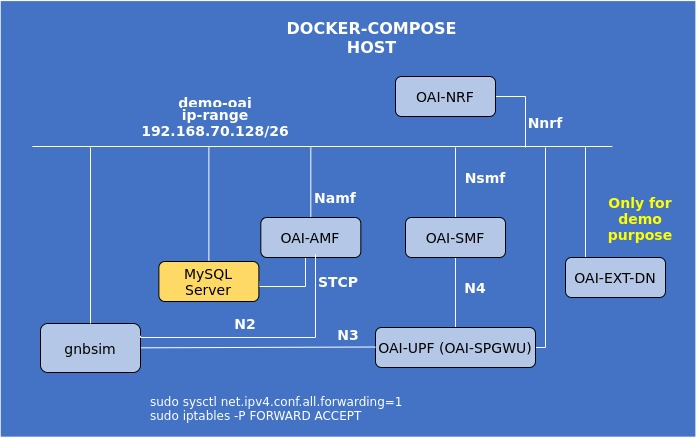

<table style="border-collapse: collapse; border: none;">
  <tr style="border-collapse: collapse; border: none;">
    <td style="border-collapse: collapse; border: none;">
      <a href="http://www.openairinterface.org/">
         
         </img>
      </a>
    </td>
    <td style="border-collapse: collapse; border: none; vertical-align: center;">
      <b><font size = "5">OpenAirInterface 5G Core Network Deployment and Testing with gnbsim</font></b>
    </td>
  </tr>
</table>

**CAUTION: 2021/10/29: This page may be obsolete and needs update.**



**Reading time: ~ 30mins**

**Tutorial replication time: ~ 1h30mins**

Note: In case readers are interested in deploying debuggers/developers core network environment with more logs please follow [this tutorial](./DEBUG_5G_CORE.md)

**TABLE OF CONTENTS**

1.  Pre-requisites
2.  Building Container Images
3.  Configuring Host Machines
4.  Configuring OAI 5G Core Network Functions
5.  Deploying OAI 5G Core Network
6.  [Getting a `gnbsim` docker image](#6-getting-a-gnbsim-docker-image)
7.  [Executing `gnbsim` Scenario](#7-executing-the-gnbsim-scenario)
8.  [Analysing Scenario Results](#8-analysing-the-scenario-results)
9.  [Trying some advanced stuff](#9-trying-some-advanced-stuff)

* In this demo the image tags and commits which were used are listed below, follow the [Building images](./BUILD_IMAGES.md) to build images with below tags.

| CNF Name    | Branch Name             | Commit at time of writing                  | Ubuntu 18.04 | RHEL8          |
| ----------- |:----------------------- | ------------------------------------------ | ------------ | ---------------|
| AMF         | `master`                | `82ca64fe8d79dbadbb1a495124ee26352f81bd7a` | X            | X              |
| SMF         | `master`                | `0dba68d6a01e1dad050f47437647f62d40acaec6` | X            | X              |
| NRF         | `master`                | `0e877cb5b80a9c74fa6abca60b95e2d3d22f7a52` | X            | X              |
| SPGW-U-TINY | `master`                | `b628036d2e6060da8ba77c5e4cdde35bf18a62a5` | X            | X              |

<br/>

This tutorial is an extension of a previous tutorial: [testing a `minimalist` deployment with dsTester](./DEPLOY_SA5G_MINI_DS_TESTER_DEPLOYMENT.md). In previous tutorial, we have seen the advanced testing tool dsTester, which is useful for validating even more complex scenarios.

Moreover, there are various other opensource gnb/ue simulator tools that are available for SA5G test. In this tutorial, we use an opensource simulator tool called `gnbsim`. With the help of `gnbsim` tool, we can perform very basic SA5G test by simulating one gnb and one ue.

##### About gnbsim -

[Gnbsim](https://github.com/hhorai/gnbsim) is a 5G SA gNB/UE (Rel. 16) simulator for testing 5G System. It 3rd party opensource tool written in golang and more information can be found [here.](https://github.com/hhorai/gnbsim) Gnbsim simulates NGAP, NAS and GTPU protocols. Current version of gnbsim simulates one gnb and one ue.

Let's begin !!

* Steps 1 to 5 are similar as previous tutorial. Please follow these steps to deploy OAI 5G core network components.
* We depoloy gnbsim docker service on same host as of core network, so there is no need to create additional route as
we did for dsTest-host.
* Before we proceed further for end-to-end SA5G test, make sure you have healthy docker services for OAI cn5g

```bash
oai-cn5g-fed/docker-compose$ ./core-network.py --type start-mini --fqdn no --scenario 1
...
[2021-09-14 16:44:47,176] root:DEBUG:  OAI 5G Core network is configured and healthy....
```

More details in [section 7 of the `minimalist` tutorial](./DEPLOY_SA5G_MINI_DS_TESTER_DEPLOYMENT.md#7-deploying-oai-5g-core-network).

```bash
oai-cn5g-fed/docker-compose$ docker ps -a
CONTAINER ID   IMAGE                           COMMAND                  CREATED          STATUS                    PORTS                          NAMES
c25db05aa023   ubuntu:bionic                   "/bin/bash -c ' apt …"   23 seconds ago   Up 22 seconds                                            oai-ext-dn
31b6391a3a41   oai-amf:latest                  "/bin/bash /openair-…"   23 seconds ago   Up 22 seconds (healthy)   80/tcp, 9090/tcp, 38412/sctp   oai-amf
753ae61f715f   oai-spgwu-tiny:latest           "/openair-spgwu-tiny…"   23 seconds ago   Up 22 seconds (healthy)   2152/udp, 8805/udp             oai-spgwu
84c164ab8136   oai-smf:latest                  "/bin/bash /openair-…"   23 seconds ago   Up 22 seconds (healthy)   80/tcp, 9090/tcp, 8805/udp     oai-smf
6f0ce91e4efb   oai-nrf:latest                  "/bin/bash /openair-…"   24 seconds ago   Up 23 seconds (healthy)   80/tcp, 9090/tcp               oai-nrf
565617169b42   mysql:5.7                       "docker-entrypoint.s…"   24 seconds ago   Up 23 seconds (healthy)   3306/tcp, 33060/tcp            mysql
oai-cn5g-fed/docker-compose$ 
```

## 6. Getting a `gnbsim` docker image ##

You have the choice:

* Build `gnbsim` docker image

```bash
$ git clone https://gitlab.eurecom.fr/kharade/gnbsim.git
$ cd gnbsim
$ docker build --tag gnbsim:latest --target gnbsim --file docker/Dockerfile.ubuntu.18.04 .
```

OR

* You can pull a prebuilt docker image for `gnbsim`

```bash
docker pull rohankharade/gnbsim
docker image tag rohankharade/gnbsim:latest gnbsim:latest
```

## 7. Executing the `gnbsim` Scenario ##

* The configuration parameters, are preconfigured in [docker-compose.yaml](../docker-compose/docker-compose.yaml) and [docker-compose-gnbsim.yaml](../docker-compose/docker-compose-gnbsim.yaml) and one can modify it for test.
* Launch gnbsim docker service
```bash
oai-cn5g-fed/docker-compose$ docker-compose -f docker-compose-gnbsim.yaml up -d gnbsim

Creating gnbsim ... done
```
* After launching gnbsim, make sure all services status are healthy -
```bash
oai-cn5g-fed/docker-compose$ docker ps -a
CONTAINER ID   IMAGE                           COMMAND                  CREATED          STATUS                    PORTS                          NAMES
2ad428f94fb0   gnbsim:latest                   "/gnbsim/bin/entrypo…"   33 seconds ago   Up 32 seconds (healthy)                                  gnbsim
c25db05aa023   ubuntu:bionic                   "/bin/bash -c ' apt …"   4 minutes ago    Up 4 minutes                                             oai-ext-dn
31b6391a3a41   oai-amf:latest                  "/bin/bash /openair-…"   4 minutes ago    Up 4 minutes (healthy)    80/tcp, 9090/tcp, 38412/sctp   oai-amf
753ae61f715f   oai-spgwu-tiny:latest           "/openair-spgwu-tiny…"   4 minutes ago    Up 4 minutes (healthy)    2152/udp, 8805/udp             oai-spgwu
84c164ab8136   oai-smf:latest                  "/bin/bash /openair-…"   4 minutes ago    Up 4 minutes (healthy)    80/tcp, 9090/tcp, 8805/udp     oai-smf
6f0ce91e4efb   oai-nrf:latest                  "/bin/bash /openair-…"   4 minutes ago    Up 4 minutes (healthy)    80/tcp, 9090/tcp               oai-nrf
565617169b42   mysql:5.7                       "docker-entrypoint.s…"   4 minutes ago    Up 4 minutes (healthy)    3306/tcp, 33060/tcp            mysql
```
Now we are ready to perform some traffic test.
* Ping test <br/>
Here we ping UE from external DN container.
```bash
$ docker exec -it oai-ext-dn ping -c 3 12.1.1.2
PING 12.1.1.2 (12.1.1.2) 56(84) bytes of data.
64 bytes from 12.1.1.2: icmp_seq=1 ttl=64 time=0.235 ms
64 bytes from 12.1.1.2: icmp_seq=2 ttl=64 time=0.145 ms
64 bytes from 12.1.1.2: icmp_seq=3 ttl=64 time=0.448 ms

--- 12.1.1.2 ping statistics ---
3 packets transmitted, 3 received, 0% packet loss, time 2036ms
rtt min/avg/max/mdev = 0.145/0.276/0.448/0.127 ms
rohan@rohan:~/gitrepo/oai-cn5g-fed/docker-compose$ 
```
* Iperf test <br/>
Here we do iperf traffic test between gnbsim UE and external DN node. We can make any node as iperf server/client.<br/>
Running iperf server on external DN container
```bash
$ docker exec -it oai-ext-dn iperf3 -s 
-----------------------------------------------------------
Server listening on 5201
-----------------------------------------------------------
Accepted connection from 12.1.1.2, port 43339
[  5] local 192.168.70.135 port 5201 connected to 12.1.1.2 port 55553
[ ID] Interval           Transfer     Bandwidth
[  5]   0.00-1.00   sec  73.8 MBytes   619 Mbits/sec                  
[  5]   1.00-2.00   sec  76.3 MBytes   640 Mbits/sec                  
[  5]   2.00-3.00   sec  77.8 MBytes   653 Mbits/sec                  
[  5]   3.00-4.00   sec  66.7 MBytes   560 Mbits/sec                  
[  5]   4.00-5.00   sec  71.9 MBytes   603 Mbits/sec                  
[  5]   5.00-6.00   sec  80.2 MBytes   673 Mbits/sec                  
[  5]   6.00-7.00   sec  76.5 MBytes   642 Mbits/sec                  
[  5]   7.00-8.00   sec  78.6 MBytes   659 Mbits/sec                  
[  5]   8.00-9.00   sec  74.5 MBytes   625 Mbits/sec                  
[  5]   9.00-10.00  sec  75.5 MBytes   634 Mbits/sec                  
[  5]  10.00-10.01  sec   740 KBytes   719 Mbits/sec                  
- - - - - - - - - - - - - - - - - - - - - - - - -
[ ID] Interval           Transfer     Bandwidth
[  5]   0.00-10.01  sec  0.00 Bytes  0.00 bits/sec                  sender
[  5]   0.00-10.01  sec   753 MBytes   631 Mbits/sec                  receiver
-----------------------------------------------------------
Server listening on 5201
-----------------------------------------------------------
```
Running iperf client on gnbsim
```bash
$ docker exec -it gnbsim iperf3 -c 192.168.70.135 -B 12.1.1.2
Connecting to host 192.168.70.135, port 5201
[  5] local 12.1.1.2 port 55553 connected to 192.168.70.135 port 5201
[ ID] Interval           Transfer     Bitrate         Retr  Cwnd
[  5]   0.00-1.00   sec  77.6 MBytes   651 Mbits/sec   29    600 KBytes       
[  5]   1.00-2.00   sec  76.2 MBytes   640 Mbits/sec    0    690 KBytes       
[  5]   2.00-3.00   sec  77.5 MBytes   650 Mbits/sec    4    585 KBytes       
[  5]   3.00-4.00   sec  66.2 MBytes   556 Mbits/sec  390    354 KBytes       
[  5]   4.00-5.00   sec  72.5 MBytes   608 Mbits/sec    0    481 KBytes       
[  5]   5.00-6.00   sec  80.0 MBytes   671 Mbits/sec    0    598 KBytes       
[  5]   6.00-7.00   sec  76.2 MBytes   640 Mbits/sec    7    684 KBytes       
[  5]   7.00-8.00   sec  78.8 MBytes   661 Mbits/sec    3    578 KBytes       
[  5]   8.00-9.00   sec  75.0 MBytes   629 Mbits/sec    1    670 KBytes       
[  5]   9.00-10.00  sec  75.0 MBytes   629 Mbits/sec    5    554 KBytes       
- - - - - - - - - - - - - - - - - - - - - - - - -
[ ID] Interval           Transfer     Bitrate         Retr
[  5]   0.00-10.00  sec   755 MBytes   633 Mbits/sec  439             sender
[  5]   0.00-10.00  sec   753 MBytes   631 Mbits/sec                  receiver

iperf Done.
```
* Note:- The iperf test is just for illustration purpose and results of the test may vary based on resources available for the docker services

## 8. Analysing the Scenario Results ##

| Container     | Ip-address     |
| ------------- |:-------------- |
| mysql         | 192.168.70.131 |
| oai-amf       | 192.168.70.132 |
| oai-smf       | 192.168.70.133 |
| oai-nrf       | 192.168.70.130 |
| oai-spgwu     | 192.168.70.134 |
| oai-ext-dn    | 192.168.70.135 |
| Host Machine  | 192.168.70.129 |
| gnbsim gNB    | 192.168.70.136 |

| Pcap/log files                                                                             |
|:------------------------------------------------------------------------------------------ |
| [5gcn-deployment-gnbsim.pcap](./results/gnbSIM/pcap/5gcn-deployment-gnbsim.pcap)                  |
| [amf.log](./results/dsTest/logs/amf.log), [initialmessage.log](./results/dsTest/logs/initialmessage.log) |
| [smf.log](./results/dsTest/logs/smf.log)                                                          |
| [nrf.log](./results/dsTest/logs/nrf.log)                                                          |
| [spgwu.log](./results/dsTest/logs/spgwu.log)   

* For detailed analysis of messages, please refer previous tutorial of [testing with dsTester](./docs/DEPLOY_SA5G_WITH_DS_TESTER.md).

## 9. Trying Some Advanced Stuff ##

Here we try some scaling test with gnbsim. There are additional IMSIs are added into database (208950000000031-208950000000040). Now we create few more gnbsim instances (4 more for now). We use same script to generate additional instance as follow -
```bash
oai-cn5g-fed/docker-compose$ docker-compose -f docker-compose-gnbsim.yaml up -d gnbsim2
Creating gnbsim2 ... done
```
So here basically, minimum configuration parameters that need to change is gnbid, imsi and container ip address in docker-compose-gnbsim.yaml.
Please make sure status of instance is healthy before creating one more instance. Now here we have deployed all 5 gnbsim intances - 
```bash
$ docker ps -a
CONTAINER ID   IMAGE                           COMMAND                  CREATED          STATUS                    PORTS                          NAMES
a25174c51297   gnbsim:latest                   "/gnbsim/bin/entrypo…"   3 minutes ago    Up 3 minutes  (healthy)                                  gnbsim5
00c6207b0064   gnbsim:latest                   "/gnbsim/bin/entrypo…"   4 minutes ago    Up 4 minutes  (healthy)                                  gnbsim4
ed440f95fb19   gnbsim:latest                   "/gnbsim/bin/entrypo…"   4 minutes ago    Up 4 minutes  (healthy)                                  gnbsim3
8c4e4098955d   gnbsim:latest                   "/gnbsim/bin/entrypo…"   14 minutes ago   Up 14 minutes (healthy)                                  gnbsim2
895b1838c62a   gnbsim:latest                   "/gnbsim/bin/entrypo…"   15 minutes ago   Up 15 minutes (healthy)                                  gnbsim
d48135fd045c   ubuntu:bionic                   "/bin/bash -c ' apt …"   16 minutes ago   Up 16 minutes                                            oai-ext-dn
5e98a708d12b   oai-amf:latest                  "/bin/bash /openair-…"   16 minutes ago   Up 16 minutes (healthy)   80/tcp, 9090/tcp, 38412/sctp   oai-amf
c64ae3c7f7c6   oai-spgwu-tiny:latest           "/openair-spgwu-tiny…"   16 minutes ago   Up 16 minutes (healthy)   2152/udp, 8805/udp             oai-spgwu
1cd8319bddb0   oai-smf:latest                  "/bin/bash /openair-…"   16 minutes ago   Up 16 minutes (healthy)   80/tcp, 9090/tcp, 8805/udp     oai-smf
9cda92a46be4   mysql:5.7                       "docker-entrypoint.s…"   16 minutes ago   Up 16 minutes (healthy)   3306/tcp, 33060/tcp            mysql
cc407925adf2   oai-nrf:latest                  "/bin/bash /openair-…"   16 minutes ago   Up 16 minutes (healthy)   80/tcp, 9090/tcp               oai-nrf

```
* Let's verify all gnb and ue are registered at our 5G core -
```bash
$ docker logs oai-amf
truncated output
[2021-05-17T12:17:28.539943] [AMF] [amf_app] [info ] 
[2021-05-17T12:17:28.539998] [AMF] [amf_app] [info ] |----------------------------------------------------------------------------------------------------------------|
[2021-05-17T12:17:28.540009] [AMF] [amf_app] [info ] |----------------------------------------------------gNBs' information-------------------------------------------|
[2021-05-17T12:17:28.540031] [AMF] [amf_app] [info ] |    Index    |      Status      |       Global ID    |    gNB Name     |               PLMN             |
[2021-05-17T12:17:28.540046] [AMF] [amf_app] [info ] |      1      |    Connected     |         0x400      |                 |            208, 95             | 
[2021-05-17T12:17:28.540056] [AMF] [amf_app] [info ] |      2      |    Connected     |         0x800      |                 |            208, 95             | 
[2021-05-17T12:17:28.540065] [AMF] [amf_app] [info ] |      3      |    Connected     |         0xc00      |                 |            208, 95             | 
[2021-05-17T12:17:28.540077] [AMF] [amf_app] [info ] |      4      |    Connected     |         0x1000     |                 |            208, 95             | 
[2021-05-17T12:17:28.540086] [AMF] [amf_app] [info ] |      5      |    Connected     |         0x1400     |                 |            208, 95             | 
[2021-05-17T12:17:28.540094] [AMF] [amf_app] [info ] |----------------------------------------------------------------------------------------------------------------|
[2021-05-17T12:17:28.540102] [AMF] [amf_app] [info ] 
[2021-05-17T12:17:28.540108] [AMF] [amf_app] [info ] |----------------------------------------------------------------------------------------------------------------|
[2021-05-17T12:17:28.540118] [AMF] [amf_app] [info ] |----------------------------------------------------UEs' information--------------------------------------------|
[2021-05-17T12:17:28.540131] [AMF] [amf_app] [info ] | Index |      5GMM state      |      IMSI        |     GUTI      | RAN UE NGAP ID | AMF UE ID |  PLMN   |Cell ID|
[2021-05-17T12:17:28.540146] [AMF] [amf_app] [info ] |      1|       5GMM-REGISTERED|   208950000000031|               |               0|          1| 208, 95 | 262160|
[2021-05-17T12:17:28.540169] [AMF] [amf_app] [info ] |      2|       5GMM-REGISTERED|   208950000000032|               |               0|          2| 208, 95 | 524304|
[2021-05-17T12:17:28.540185] [AMF] [amf_app] [info ] |      3|       5GMM-REGISTERED|   208950000000033|               |               0|          3| 208, 95 | 786448|
[2021-05-17T12:17:28.540197] [AMF] [amf_app] [info ] |      4|       5GMM-REGISTERED|   208950000000034|               |               0|          4| 208, 95 |1048592|
[2021-05-17T12:17:28.540211] [AMF] [amf_app] [info ] |      5|       5GMM-REGISTERED|   208950000000035|               |               0|          5| 208, 95 |1310736|
[2021-05-17T12:17:28.540219] [AMF] [amf_app] [info ] |----------------------------------------------------------------------------------------------------------------|
[2021-05-17T12:17:28.540227] [AMF] [amf_app] [info ] 

```
* Finally lets ping UE from external DN node -
```bash
$ docker exec -it oai-ext-dn ping -c 2 12.1.1.2
PING 12.1.1.2 (12.1.1.2) 56(84) bytes of data.
64 bytes from 12.1.1.2: icmp_seq=1 ttl=64 time=0.416 ms
64 bytes from 12.1.1.2: icmp_seq=2 ttl=64 time=0.763 ms

--- 12.1.1.2 ping statistics ---
2 packets transmitted, 2 received, 0% packet loss, time 1008ms
rtt min/avg/max/mdev = 0.416/0.589/0.763/0.175 ms
$ docker exec -it oai-ext-dn ping -c 2 12.1.1.3
PING 12.1.1.3 (12.1.1.3) 56(84) bytes of data.
64 bytes from 12.1.1.3: icmp_seq=1 ttl=64 time=0.328 ms
64 bytes from 12.1.1.3: icmp_seq=2 ttl=64 time=0.620 ms

--- 12.1.1.3 ping statistics ---
2 packets transmitted, 2 received, 0% packet loss, time 1005ms
rtt min/avg/max/mdev = 0.328/0.474/0.620/0.146 ms
$ docker exec -it oai-ext-dn ping -c 2 12.1.1.4
PING 12.1.1.4 (12.1.1.4) 56(84) bytes of data.
64 bytes from 12.1.1.4: icmp_seq=1 ttl=64 time=0.408 ms
64 bytes from 12.1.1.4: icmp_seq=2 ttl=64 time=0.694 ms

--- 12.1.1.4 ping statistics ---
2 packets transmitted, 2 received, 0% packet loss, time 1032ms
rtt min/avg/max/mdev = 0.408/0.551/0.694/0.143 ms
$ docker exec -it oai-ext-dn ping -c 2 12.1.1.5
PING 12.1.1.5 (12.1.1.5) 56(84) bytes of data.
64 bytes from 12.1.1.5: icmp_seq=1 ttl=64 time=0.289 ms
64 bytes from 12.1.1.5: icmp_seq=2 ttl=64 time=0.233 ms

--- 12.1.1.5 ping statistics ---
2 packets transmitted, 2 received, 0% packet loss, time 1004ms
rtt min/avg/max/mdev = 0.233/0.261/0.289/0.028 ms
```

Last thing is to remove all services - <br/>

* Undeploy the gnbsim
```bash
/oai-cn5g-fed/docker-compose$ docker-compose -f docker-compose-gnbsim.yaml down
Stopping service gnbsim ...
Stopping gnbsim ... done
Removing gnbsim ... done
Network demo-oai-public-net is external, skipping
Service gnbsim is  stopped
```

* Undeploy the core network
```bash
oai-cn5g-fed/docker-compose$ ./core-network.py --type stop-mini --fqdn no --scenario 1
...
[2021-09-14 16:47:44,070] root:DEBUG:  OAI 5G core components are UnDeployed....
```

