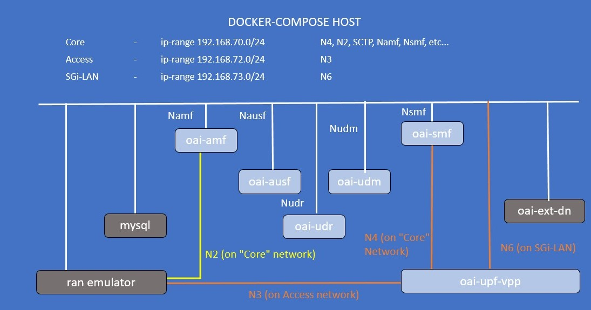

<table style="border-collapse: collapse; border: none;">
  <tr style="border-collapse: collapse; border: none;">
    <td style="border-collapse: collapse; border: none;">
      <a href="http://www.openairinterface.org/">
         
         </img>
      </a>
    </td>
    <td style="border-collapse: collapse; border: none; vertical-align: center;">
      <b><font size = "5">OpenAirInterface 5G Core Network Deployment with UPF-VPP using docker-compose</font></b>
    </td>
  </tr>
</table>



**Reading time: ~ 30mins**

**Tutorial replication time: ~ 1h30mins**

Note: In case readers are interested in deploying debuggers/developers core network environment with more logs, please follow [this tutorial](./DEBUG_5G_CORE.md)

**TABLE OF CONTENTS**

1.  Pre-requisites
2.  Building Container Images
3.  Configuring Host Machines
4.  Configuring OAI 5G Core Network Functions
5.  [Deploying OAI 5G Core Network with VPP-UPF](#5-deploying-oai-5g-core-network)
6.  [Stimuli with a RAN emulator](#6-stimuli-with-a-ran-emulator)
7.  [Undeploy the Core Network](#7-undeploy-the-core-network)

* In this demo the image tags and commits which were used are listed below, follow the [Building images](./BUILD_IMAGES.md) to build images with below tags. 

You can also retrieve the images from `docker-hub`. See [Retrieving images](./RETRIEVE_OFFICIAL_IMAGES.md).

| CNF Name    | Branch Name    | Tag used at time of writing   | Ubuntu 18.04 | RHEL8          |
| ----------- |:-------------- | ----------------------------- | ------------ | ---------------|
| AMF         | `master`       | `v1.2.1`                      | X            | X              |
| AUSF        | `master`       | `v1.2.1`                      | X            | X              |
| NRF         | `master`       | `v1.2.1`                      | X            | X              |
| SMF         | `master`       | `v1.2.1`                      | X            | X              |
| UDR         | `master`       | `v1.2.1`                      | X            | X              |
| UDM         | `master`       | `v1.2.1`                      | X            | X              |
| UPF-VPP     | `master`       | `v1.2.1`                      | X            | X              |

<br/>

In previous tutorials, we were using the `oai-spgwu-tiny` implementation UPF. That implementation has limited throughput capacity and is a pure SW solution.

Moreover in this tutorial, we are going to integrate OAI 5G core with opensource `VPP-UPF` by [Travelping](https://www.travelping.com/). VPP-based UPF uses vector packet processing and it is has proven very good performance in the user plane. Motivation for this integration to test and validate high performance VPP-UPF in with OAI 5G core.

##### About VPP-UPG -

UPG implements a GTP-U user plane based on `3GPP TS 23.214` and `3GPP TS 29.244` Release `15`. It is implemented as an
out-of-tree plugin for [Fdio VPP](https://github.com/FDio/vpp). The possible uses for UPG are:
* User Plane Function (UPF) in 5G networks
* Packet Data Network Gateway User plane (PGW-U)
* Traffic Detection Function User plane (TDF-U)

Project is available on github as VPP-UPG which follows release `16` of 3GPP specification TS `29.244`. More details about VPP-UPG can be found on [official page](https://github.com/travelping/upg-vpp). VPP-UPG currently doesn't support NRF feature hence and it also uses optional IE called network instance (nwi) to uniquely identify interfaces of UPF in the form of domain name.

Let's begin !!

* Steps 1 to 4 are similar as previous tutorials such as [minimalist](./DEPLOY_SA5G_MINI_DS_TESTER_DEPLOYMENT.md) or [basic](./DEPLOY_SA5G_BASIC_DS_TESTER_DEPLOYMENT.md) deployments. Please follow these steps to deploy OAI 5G core network components.

## 5. Deploying OAI 5g Core Network ##

* We will use same wrapper script for docker-compose that used for previous tutorials to set up 5gcn with `UPF-VPP`. Use help option to check how to use this wrapper script.

```bash
oai-cn5g-fed/docker-compose$ $ python3 ./core-network.py --help
usage: core-network.py [-h] --type
                       {start-mini,start-basic,start-basic-vpp,stop-mini,stop-basic,stop-basic-vpp}
                       [--fqdn {yes,no}] [--scenario {1,2}]

OAI 5G CORE NETWORK DEPLOY

optional arguments:
  -h, --help            show this help message and exit
  --type {start-mini,start-basic,start-basic-vpp,stop-mini,stop-basic,stop-basic-vpp}, -t {start-mini,start-basic,start-basic-vpp,stop-mini,stop-basic,stop-basic-vpp}
                        Functional type of 5g core network ("start-
                        mini"|"start-basic"|"start-basic-vpp"|"stop-
                        mini"|"stop-basic"|"stop-basic-vpp")
  --fqdn {yes,no}, -fq {yes,no}
                        Deployment scenario with FQDN ("yes"|"no")
  --scenario {1,2}, -s {1,2}
                        Scenario with NRF ("1") and without NRF ("2")

example:
        python3 core-network.py --type start-mini
        python3 core-network.py --type start-basic
        python3 core-network.py --type start-basic-vpp
        python3 core-network.py --type stop-mini
        python3 core-network.py --type start-mini --fqdn no --scenario 2
        python3 core-network.py --type start-basic --fqdn no --scenario 2

```

Currently in this tutorial format, we support a `basic` deployment with the `UPF-VPP`: `basic-vpp`.

In that deployment configuration, you can deploy with and without `NRF` (ie scenarios `1` and `2`).

For the moment, `FQDN` shall be set to `no`.

```bash
oai-cn5g-fed/docker-compose$ python3 ./core-network.py --type start-basic-vpp --fqdn no --scenario 1
[2021-10-29 11:11:43,753] root:DEBUG:  Starting 5gcn components... Please wait....
Creating network "oai-public-cp" with the default driver
Creating network "oai-public-access" with the default driver
Creating network "oai-public-core" with the default driver
Creating mysql   ... done
Creating oai-nrf ... done
Creating vpp-upf ... done
Creating oai-udr ... done
Creating oai-udm    ... done
Creating oai-ext-dn ... done
Creating oai-ausf   ... done
Creating oai-amf    ... done
Creating oai-smf    ... done

[2021-10-29 11:12:27,542] root:DEBUG:  OAI 5G Core network started, checking the health status of the containers... takes few secs....
[2021-10-29 11:13:22,607] root:DEBUG:  All components are healthy, please see below for more details....
Name                 Command                  State                  Ports            
-----------------------------------------------------------------------------------------
mysql        docker-entrypoint.sh mysqld      Up (healthy)   3306/tcp, 33060/tcp         
oai-amf      /bin/bash /openair-amf/bin ...   Up (healthy)   38412/sctp, 80/tcp, 9090/tcp
oai-ausf     /bin/bash /openair-ausf/bi ...   Up (healthy)   80/tcp                      
oai-ext-dn   /bin/bash -c  apt update;  ...   Up                                         
oai-nrf      /bin/bash /openair-nrf/bin ...   Up (healthy)   80/tcp, 9090/tcp            
oai-smf      /bin/bash /openair-smf/bin ...   Up (healthy)   80/tcp, 8805/udp, 9090/tcp  
oai-udm      /bin/bash /openair-udm/bin ...   Up (healthy)   80/tcp                      
oai-udr      /bin/bash /openair-udr/bin ...   Up (healthy)   80/tcp                      
vpp-upf      /openair-upf/bin/entrypoin ...   Up (healthy)   2152/udp, 8085/udp
[2021-10-29 11:13:22,608] root:DEBUG:  Checking if the containers are configured....
[2021-10-29 11:13:22,608] root:DEBUG:  Checking if AMF, SMF and UPF registered with nrf core network....
[2021-10-29 11:13:22,695] root:DEBUG:  For example: oai-smf Registration with oai-nrf can be checked on this url /nnrf-nfm/v1/nf-instances?nf-type="SMF" {"_links":{"item":[{"href":"192.168.70.133"}],"self":""}}....
[2021-10-29 11:13:22,695] root:DEBUG:  AMF, SMF and UPF are registered to NRF....
[2021-10-29 11:13:22,695] root:DEBUG:  Checking if SMF is able to connect with UPF....
[2021-10-29 11:13:22,822] root:DEBUG:  UPF did answer to N4 Association request from SMF....
[2021-10-29 11:13:22,884] root:DEBUG:  SMF receiving heathbeats from UPF....
[2021-10-29 11:13:22,885] root:DEBUG:  OAI 5G Core network is configured and healthy....
```

Here I have deployed with `NRF`:

* The script validates that `AMF`, `SMF` and `UPF-VPP` did register to `NRF`
  - Currently `AUSF`, `UDM` and `UDR` do not support this. Will be added soon.
* The script also validates that SMF associates over `N4` with UPF.

You can also see this with the container logs:

1. UPF registration to NRF
```bash
$ docker logs oai-nrf
...
[2021-10-29T11:12:10.995675] [nrf] [sbi_srv] [info ] Got a request to register an NF instance/Update an NF instance, Instance ID: cdf2e275-ff1d-49e0-aa48-df2027af101f
[2021-10-29T11:12:10.995701] [nrf] [nrf_app] [info ] Handle Register NF Instance/Update NF Instance (HTTP version 2)
[2021-10-29T11:12:10.996429] [nrf] [nrf_app] [info ] Check if a profile with this ID cdf2e275-ff1d-49e0-aa48-df2027af101f exist
[2021-10-29T11:12:10.996442] [nrf] [nrf_app] [info ] NF profile (ID cdf2e275-ff1d-49e0-aa48-df2027af101f) not found
[2021-10-29T11:12:10.996446] [nrf] [nrf_app] [info ] Added/Updated NF Profile (ID cdf2e275-ff1d-49e0-aa48-df2027af101f) to the DB
[2021-10-29T11:12:10.996457] [nrf] [nrf_app] [info ] Handle NF status registered event, profile id cdf2e275-ff1d-49e0-aa48-df2027af101f
[2021-10-29T11:12:10.996460] [nrf] [nrf_app] [info ] 	Find a NF profile with ID cdf2e275-ff1d-49e0-aa48-df2027af101f
[2021-10-29T11:12:10.996464] [nrf] [nrf_app] [info ] 	Get the list of subscriptions related to this profile, profile id cdf2e275-ff1d-49e0-aa48-df2027af101f
[2021-10-29T11:12:10.996526] [nrf] [nrf_app] [info ] Added/Updated NF Instance, NF info: {"capacity":100,"fqdn":"gw1.vppupf.node.5gcn.mnc95.mcc208.3gppnetwork.org","heartBeatTimer":10,"ipv4Addresses":["192.168.70.202"],"json_data":null,"nfInstanceId":"cdf2e275-ff1d-49e0-aa48-df2027af101f","nfInstanceName":"OAI-UPF-VPP","nfServices":[],"nfStatus":"REGISTERED","nfType":"UPF","priority":1,"sNssais":[{"sd":"222","sst":123}],"upfInfo":{"interfaceUpfInfoList":[{"endpointFqdn":"access.oai.org","interfaceType":"N3","ipv4EndpointAddresses":["192.168.72.134"],"networkInstance":"access.oai.org"},{"endpointFqdn":"core.oai.org","interfaceType":"N6","ipv4EndpointAddresses":["192.168.70.134"],"networkInstance":"core.oai.org"}],"sNssaiUpfInfoList":[{"dnnUpfInfoList":[{"dnn":"default"}],"sNssai":{"sd":"222","sst":123}}]}}
[2021-10-29T11:12:16.002236] [nrf] [sbi_srv] [info ] 
[2021-10-29T11:12:16.002261] [nrf] [sbi_srv] [info ] Got a request to update an NF instance, Instance ID: cdf2e275-ff1d-49e0-aa48-df2027af101f
[2021-10-29T11:12:16.002268] [nrf] [nrf_app] [info ] Handle Update NF Instance request (HTTP version 2)
[2021-10-29T11:12:16.002277] [nrf] [nrf_app] [info ] NF Heart-Beat procedure!
[2021-10-29T11:12:16.002282] [nrf] [nrf_app] [info ] Updated the NF profile (profile ID cdf2e275-ff1d-49e0-aa48-df2027af101f)
[2021-10-29T11:12:21.057964] [nrf] [sbi_srv] [info ] 
[2021-10-29T11:12:21.057985] [nrf] [sbi_srv] [info ] Got a request to update an NF instance, Instance ID: cdf2e275-ff1d-49e0-aa48-df2027af101f
...
```
2. SMF PFCP association with UPF-VPP
```bash
$ docker logs oai-smf
...
[2021-10-29T11:12:27.497176] [smf] [smf_sbi] [debug] Send NFSubscribeNotify to NRF to be notified when a new UPF becomes available (HTTP version 1)
[2021-10-29T11:12:27.497202] [smf] [smf_sbi] [debug] Send NFStatusNotify to NRF, NRF URL 192.168.70.130:80/nnrf-nfm/v1/subscriptions
[2021-10-29T11:12:27.497423] [smf] [smf_sbi] [debug] Send NFStatusNotify to NRF, msg body: {"nfStatusNotificationUri":"192.168.70.133:80/nsmf-nfstatus-notify/v1/subscriptions","reqNotifEvents":["NF_REGISTERED","NF_DEREGISTERED"],"subscrCond":{"NfTypeCond":{"nfType":"UPF"}},"validityTime":"20390531T235959"}
[2021-10-29T11:12:27.497450] [smf] [smf_sbi] [debug] Promise ID generated 1
[2021-10-29T11:12:27.499881] [smf] [sbi_srv] [info ] NFStatusNotifyApiImpl, received a NF status notification...
[2021-10-29T11:12:27.499897] [smf] [smf_app] [debug] Convert NotificationData (OpenAPI) to Data Notification Msg
[2021-10-29T11:12:27.500400] [smf] [smf_app] [debug] NF instance info
[2021-10-29T11:12:27.500411] [smf] [smf_app] [debug] 	Instance ID: cdf2e275-ff1d-49e0-aa48-df2027af101f
[2021-10-29T11:12:27.500415] [smf] [smf_app] [debug] 	Instance name: OAI-UPF-VPP
[2021-10-29T11:12:27.500418] [smf] [smf_app] [debug] 	Instance type: UPF
[2021-10-29T11:12:27.500422] [smf] [smf_app] [debug] 	Status: REGISTERED
[2021-10-29T11:12:27.500425] [smf] [smf_app] [debug] 	HeartBeat timer: 10
[2021-10-29T11:12:27.500429] [smf] [smf_app] [debug] 	Priority: 1
[2021-10-29T11:12:27.500432] [smf] [smf_app] [debug] 	Capacity: 100
[2021-10-29T11:12:27.500436] [smf] [smf_app] [debug] 	SNSSAI:
[2021-10-29T11:12:27.500439] [smf] [smf_app] [debug] 		 SST 123, SD 222
[2021-10-29T11:12:27.500443] [smf] [smf_app] [debug] 	FQDN: gw1.vppupf.node.5gcn.mnc95.mcc208.3gppnetwork.org
[2021-10-29T11:12:27.500446] [smf] [smf_app] [debug] 	IPv4 Addr:
[2021-10-29T11:12:27.500451] [smf] [smf_app] [debug] 		 192.168.70.202
[2021-10-29T11:12:27.500454] [smf] [smf_app] [debug] 	UPF Info:
[2021-10-29T11:12:27.500459] [smf] [smf_app] [debug] 		Parameters supported by the UPF:
[2021-10-29T11:12:27.500463] [smf] [smf_app] [debug] 			SNSSAI (SST 123, SD 222)
[2021-10-29T11:12:27.500468] [smf] [smf_app] [debug] 			DNN default
[2021-10-29T11:12:27.500474] [smf] [smf_app] [debug] 		INTERFACE UPF Info List, Interface Type : N3, Network Instance access.oai.org, EndpointFqdn: access.oai.org
[2021-10-29T11:12:27.500480] [smf] [smf_app] [debug] 			INTERFACE UPF Info List, IPv4 Addr:
[2021-10-29T11:12:27.500484] [smf] [smf_app] [debug] 						 192.168.72.134
[2021-10-29T11:12:27.500489] [smf] [smf_app] [debug] 		INTERFACE UPF Info List, Interface Type : N6, Network Instance core.oai.org, EndpointFqdn: core.oai.org
[2021-10-29T11:12:27.500494] [smf] [smf_app] [debug] 			INTERFACE UPF Info List, IPv4 Addr:
[2021-10-29T11:12:27.500498] [smf] [smf_app] [debug] 						 192.168.70.134
[2021-10-29T11:12:27.500559] [smf] [smf_app] [info ] Handle a NF status notification from NRF (HTTP version 1)
[2021-10-29T11:12:27.500587] [smf] [smf_app] [debug] Add a new UPF node, Ipv4 Addr 192.168.70.202
[2021-10-29T11:12:27.501350] [smf] [smf_app] [debug] Got response with HTTP code  201!
...
[2021-10-29T11:12:27.510608] [smf] [smf_n4 ] [info ] Received N4 ASSOCIATION SETUP RESPONSE from an UPF
[2021-10-29T11:12:27.510634] [smf] [smf_n4 ] [info ] Received N4 ASSOCIATION SETUP RESPONSE
[2021-10-29T11:12:27.510649] [smf] [smf_app] [info ] Node ID Type FQDN: gw1.vppupf.node.5gcn.mnc95.mcc208.3gppnetwork.org
[2021-10-29T11:12:27.511111] [smf] [smf_app] [info ] Node ID Type FQDN: gw1.vppupf.node.5gcn.mnc95.mcc208.3gppnetwork.org, IPv4 Addr: 192.168.70.202
[2021-10-29T11:12:27.511213] [smf] [smf_app] [debug] NF instance info
[2021-10-29T11:12:27.511221] [smf] [smf_app] [debug] 	Instance ID: 
[2021-10-29T11:12:27.511225] [smf] [smf_app] [debug] 	Instance name: 
[2021-10-29T11:12:27.511228] [smf] [smf_app] [debug] 	Instance type: UPF
[2021-10-29T11:12:27.511231] [smf] [smf_app] [debug] 	Status: 
[2021-10-29T11:12:27.511235] [smf] [smf_app] [debug] 	HeartBeat timer: 0
[2021-10-29T11:12:27.511238] [smf] [smf_app] [debug] 	Priority: 0
[2021-10-29T11:12:27.511241] [smf] [smf_app] [debug] 	Capacity: 0
...
```

## 6. Stimuli with a RAN emulator ##

**CAUTION: at time of writing (2021/10/29), this section is empty. Will be filled later.**


## 7. Undeploy the Core Network ##

```bash
oai-cn5g-fed/docker-compose$ python3 ./core-network.py --type stop-basic-vpp --fqdn no --scenario 1
[2021-10-29 11:14:08,130] root:DEBUG:  UnDeploying OAI 5G core components....
Stopping oai-smf    ... done
Stopping oai-amf    ... done
Stopping oai-ausf   ... done
Stopping oai-ext-dn ... done
Stopping oai-udm    ... done
Stopping oai-udr    ... done
Stopping vpp-upf    ... done
Stopping oai-nrf    ... done
Stopping mysql      ... done
Removing oai-smf    ... done
Removing oai-amf    ... done
Removing oai-ausf   ... done
Removing oai-ext-dn ... done
Removing oai-udm    ... done
Removing oai-udr    ... done
Removing vpp-upf    ... done
Removing oai-nrf    ... done
Removing mysql      ... done
Removing network oai-public-cp
Removing network oai-public-access
Removing network oai-public-core

[2021-10-29 11:15:21,322] root:DEBUG:  OAI 5G core components are UnDeployed....
```


