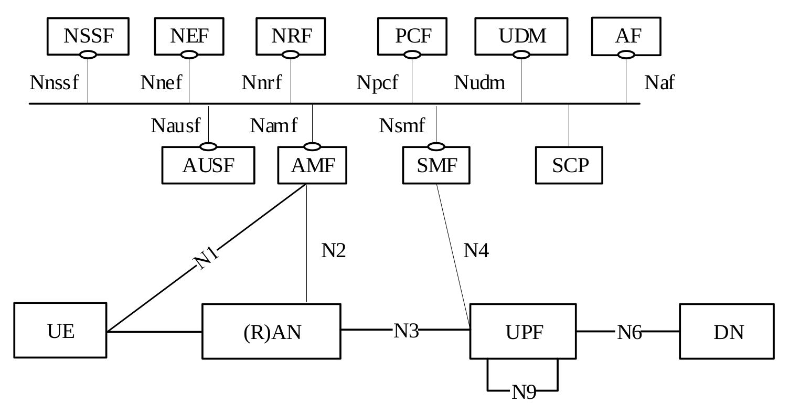

<table style="border-collapse: collapse; border: none;">
  <tr style="border-collapse: collapse; border: none;">
    <td style="border-collapse: collapse; border: none;">
      <a href="http://www.openairinterface.org/">
         
         </img>
      </a>
    </td>
    <td style="border-collapse: collapse; border: none; vertical-align: center;">
      <b>OpenAirInterface AMF Feature Set</b>
    </td>
  </tr>
</table>

**Table of Contents**

1. [5GC Service Based Architecture](#1-5gc-service-based-architecture)
2. [OAI AMF Available Interfaces](#2-oai-smf-available-interfaces)
3. [OAI AMF Feature List](#3-oai-smf-feature-list)

# 1. 5GC Service Based Architecture #

# 2. OAI AMF Available Interfaces #

| **ID** | **Interface** | **Status**         | **Comment**                                                               |
| ------ | ------------- | ------------------ | --------------------------------------------------------------------------|
| 1      | N1            | :heavy_check_mark: | Communicate with UE via NAS message                                       |
| 2      | N2            | :heavy_check_mark: | Communicate with gNB via NGAP message                                     |
| 3      | N8            | :x:                | Interface to/from UDM (e.g., retrieve UE subscription data)               |
| 4      | N11           | :heavy_check_mark: | Interface to/from SMF (e.g., N1N2MessageTransfer, PDU Session Services)   |
| 5      | N14           | :x:                | Interface between AMFs                                                    |
| 6      | N15           | :x:                | Interface between AMF and PCF                                             |

# 3. OAI AMF Feature List #

Based on document **3GPP TS 23.501 V16.0.0 §6.2.1**.

| **ID** | **Classification**                                                  | **Status**         | **Comments**                                |
| ------ | ------------------------------------------------------------------- | ------------------ | ------------------------------------------- |
| 1      | Termination of RAN CP interface (N2)                                | :heavy_check_mark: | Communicate with gNB via NGAP message       |
| 2      | Termination of NAS (N1)                                             | :heavy_check_mark: | Communicate with UE via NAS message         |
| 3      | NAS ciphering and integrity protection                              | :heavy_check_mark: |                                             |
| 4      | Registration management                                             | :heavy_check_mark: |                                             |
| 5      | Connection management                                               | :heavy_check_mark: |                                             |
| 6      | Reachability management                                             | :x:                |                                             |
| 7      | Mobility Management                                                 | :x:                |                                             |
| 8      | Lawful intercept (for AMF events and interface to LI System)        | :x:                |                                             |
| 9      | Provide transport for SM messages between UE and SMF                | :heavy_check_mark: |                                             |
| 10     | Transparent proxy for routing SM messages                           | :x:                |                                             |
| 11     | Access Authentication                                               | :heavy_check_mark: |                                             |
| 12     | Access Authorization                                                | :heavy_check_mark: |                                             |
| 13     | Provide transport for SMS messages between UE and SMSF.             | :x:                |                                             |
| 14     | Security Anchor Functionality (SEAF)                                | :heavy_check_mark: |                                             |
| 15     | Location Services management for regulatory services                | :x:                |                                             |
| 16     | Provide transport for Location Services messages between            |                    |                                             |
|        | UE and LMF as well as between RAN and LMF.                          | :x:                |                                             |
| 17     | EPS Bearer ID allocation for interworking with EPS.                 | :x:                |                                             |
| 18     | UE mobility event notification                                      | :x:                |                                             |
| 19     | Support for Control Plane CIoT 5GS Optimisation.                    | :x:                |                                             |
| 20     | Provisioning of external parameters                                 | :x:                |                                             |
| 21     | Support non-3GPP access networks                                    | :x:                |                                             |

