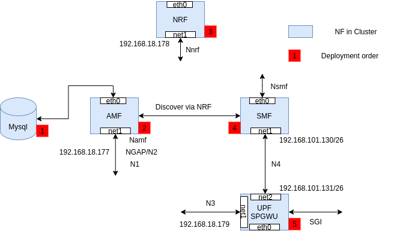

<table style="border-collapse: collapse; border: none;">
  <tr style="border-collapse: collapse; border: none;">
    <td style="border-collapse: collapse; border: none;">
      <a href="http://www.openairinterface.org/">
         
         </img>
      </a>
    </td>
    <td style="border-collapse: collapse; border: none; vertical-align: center;">
      <b><font size = "5">OpenAirInterface 5G Core Network Deployment using Helm Charts</font></b>
    </td>
  </tr>
</table>

**TABLE OF CONTENTS**

1.  [Description](#1-description)
3.  [Building Images](#2-building-images)
3.  [Configuring Helm Charts](#3-configuring-helm-charts)
4.  [Deploying Helm Charts](#4-deploying-helm-charts)


## 1. Description

The helm charts can be used on any production grade kubernetes cluster. Currently they are only tested on our inhouse Openshift cluster the cluster information can be found below.

| Software                 | Version                             |
|:------------------------ |:----------------------------------- |
| Openshift Client Version | 4.4.10                              |
| Kubernetes Version       | Kubernetes Version: v1.17.1+45f8ddb |
| helm                     | v3.5.3                              |

### Pre-requisite

The cluster on which these helm charts will be deployed should have RBAC and [Multus CNI](https://github.com/k8snetworkplumbingwg/multus-cni). Multus is necessary to provide multiple interfaces not network functions. 

## 2. Building Images

The base image used by network function is dependent on the operating system it will be running on. If it is a debian (ubuntu) based cluster then build base image will be ubuntu. If it is a rpm (core-os) based cluster then build base images will ubi. [Build images](./BUILD_IMAGES.md) depending on the cluster/worker-node operating system. 

## 3. Configuring Helm Charts

Clone the helm chart repository from gitlab currently it is present in helm-chart branch but soon it will be merged in master. 

```
$ git clone -b helm-charts https://gitlab.eurecom.fr/oai/cn5g/oai-cn5g-fed.git
$ cd charts
$ ls charts
mysql  oai-amf  oai-nrf  oai-smf  oai-spgwu-tiny
```

Helm chart of every network function looks similar and has the below structure. Only the chart of mysql database is different. 

```
Network_function/
├── Chart.yaml
├── templates
│   ├── configmap.yaml
│   ├── deployment.yaml
│   ├── _helpers.tpl
│   ├── multus.yaml
│   ├── NOTES.txt
│   ├── rbac.yaml
│   ├── serviceaccount.yaml
│   └── service.yaml
└── values.yaml 

1 directory, 10 files
```

All the configurable parameters for a particular commit/release are mentioned in the `values.yaml` file. These parameters will keep on changing in the future depending on the nature of development and features. **If there is a need to edit a specific configuration parameter then it has to be changed at the time of building images.** 

Depending on the namespace where these charts will be instantiated change the value of `namespace` parameter in `values.yaml`. All the network function related configurable parameters are in the sections `config` of the `values.yaml`

### 3.1 Networking related information

The current networking configuration and static ip-address for the network functions is based on what we are using on our openshift cluster for testing. The ip-address should be configured in a way that 

- AMF pod is able to reach NRF, SMF and Mysql pod, 
- UPF(SPGWU) pod should be able to reach NRF and SMF pod and 
- SMF pod should be able to reach AMF, NRF and UPF(SPGWU).  

**Through NRF AMF, SMF and UPF can discover each other.**

Refer the below diagram to understand the networking, 




NOTE: Kubernetes service name (FQDN) can not be used in place of ip-address. It is recommend to give ip-address. 

### 3.2 Configuring AMF

Based on the information in gNB these parameters should be configured. 
```
  mcc: "208"
  mnc: "95"
  regionId: "128"
  amfsetId: "1"
  servedGuamiMcc0: "208"
  servedGuamiMnc0: "95"
  servedGuamiRegionId0: "128"
  servedGuamiAmfSetId0: "1"
  servedGuamiMcc1: "460"
  servedGuamiMnc1: "11"
  servedGuamiRegionId1: "10"
  servedGuamiAmfSetId1: "1"
  plmnSupportMcc: "208"
  plmnSupportMnc: "95"
  plmnSupportTac: "0xa000"
  sst0: "222"
  sd0: "123"
  sst1: "1"
  sd1: "12"
```

The mysql database is pre-configured with some subscriber information. If there is new subscriber information then it should be configured in the mysql database. The subscriber PLMN information should match with gNB and AMF. 

```
  mySqlServer: "mysql"
  mySqlUser: "root"
  mySqlPass: "linux"
  mySqlDb: "oai_db"
  operatorKey: "63bfa50ee6523365ff14c1f45f88737d" (should be the same in mysql)
```

### 3.3 Configuring SMF

Dns configuration based on the network

```
  dnsIpv4Address: ""
  dnsSecIpv4Address: ""
```

Currenly APN related information and UE network related information can only be changed at the time of building the SMF network function. Refer [Configure the Containers](./CONFIGURE_CONTAINERS.md) to understand how it can be done. 

## 4. Deploying Helm Charts

Helm charts have an order of deployment for the proper configuration of core network. 

`mysql --> amf --> nrf --> smf --> upf(spgwu)`

Once the configuration is finished the charts can be deployed with a user who has the rights to

1. Create RBAC
2. Run pod with privileged scc
3. Create multus binds 

```
$ helm install mysql mysql/
# wait for the pod to come up
$ helm install amf oai-amf/
# wait for the pod to come up
$ helm install nrf oai-nrf/
# wait for the pod to come up
$ helm install smf oai-smf/
# wait for the pod to come up
$ helm install spgwu oai-spgwu-tiny/
# wait for the pod to come up
$ helm list
NAME  NAMESPACE       REVISION  UPDATED                                   STATUS    CHART                 APP VERSION
amf   oai-5g-develop  1         2021-05-12 12:07:36.345877418 +0200 CEST  deployed  oai-amf-0.1.0         0.1.0 
mysql oai-5g-develop  1         2021-05-12 11:09:32.597525506 +0200 CEST  deployed  mysql-1.6.9           5.7.30     
nrf   oai-5g-develop  1         2021-05-12 11:32:43.648706741 +0200 CEST  deployed  oai-nrf-0.1.0         0.1.0 
smf   oai-5g-develop  1         2021-05-12 12:05:38.251220635 +0200 CEST  deployed  oai-smf-0.1.0         0.1.0 
spgwu oai-5g-develop  1         2021-05-12 12:08:31.408369994 +0200 CEST  deployed  oai-spgwu-tiny-0.1.1  0.1.1 
```