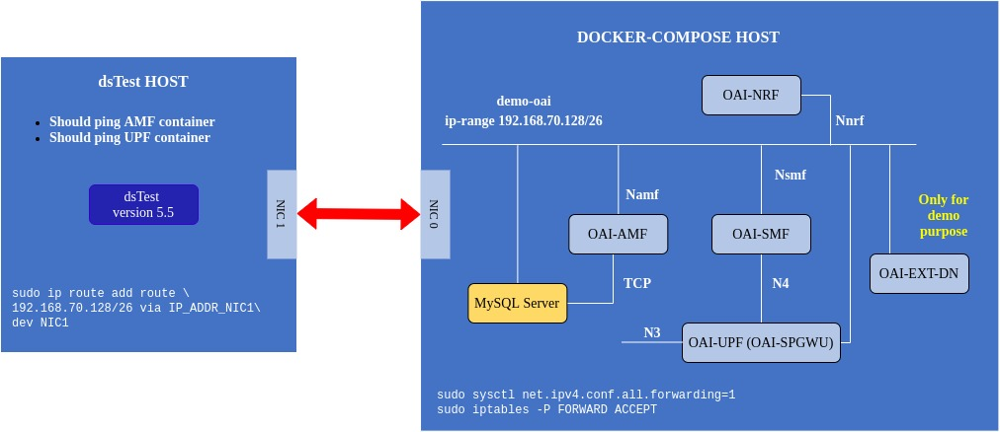
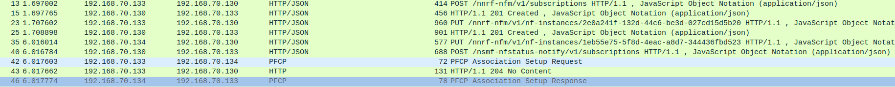
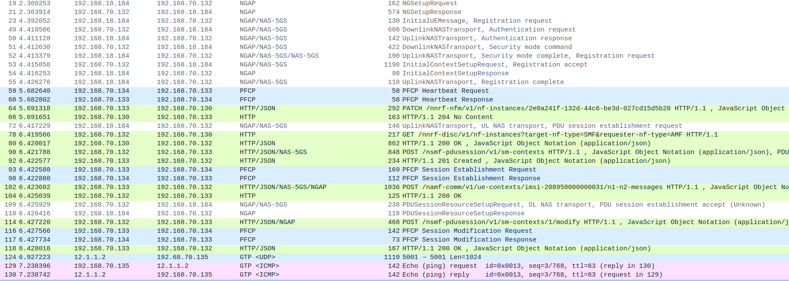
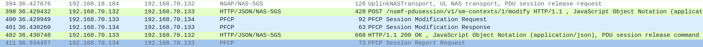

<table style="border-collapse: collapse; border: none;">
  <tr style="border-collapse: collapse; border: none;">
    <td style="border-collapse: collapse; border: none;">
      <a href="http://www.openairinterface.org/">
         
         </img>
      </a>
    </td>
    <td style="border-collapse: collapse; border: none; vertical-align: center;">
      <b><font size = "5">OpenAirInterface 5G Core Network Deployment and Testing with dsTest</font></b>
    </td>
  </tr>
</table>




**TABLE OF CONTENTS**

1.  [Pre-requisites](#1-pre-requisites)
2.  [Building Container Images](#2-building-container-images)
3.  [Configuring Host Machines](#3-configuring-host-machines)
4.  [Configuring OAI 5G Core Network Functions](#4-configuring-the-oai-5g-core-network-functions)
5.  [Configuring dsTest Scenario](#5-configuring-dstester-scenario)
6.  [Deploying OAI 5G Core Network](#6-deploying-oai-5g-core-network)
7.  [Executing dsTest Scenario](#7-executing-the-dstest-scenario)
8.  [Analysing Scenario Results](#8-analysing-the-scenario-results)
9.  [Demo Video](#9-demo-video)
10. [Notes](#10-notes)

## 1. Pre-requisites ##

The container images are built using `docker build` command on Ubuntu 18.04 host machine. The base image for all the containers is Ubuntu 18.04. 

The requried softwares and their respected versions are listed below. To replicate the testbed use these versions. 


| Software                   | Version                         |
|:-------------------------- |:------------------------------- |
| docker engine              | 19.03.6, build 369ce74a3c       |
| docker-compose             | 1.27.4, build 40524192          |
| Host operating system      | Ubuntu 18.04.4 LTS              |
| Container operating system | Ubuntu 18.04                    |
| dsTest (Licensed)          | 5.5                             |
| tshark                     | 3.4.4 (Git commit c33f6306cbb2) |
| wireshark                  | 3.4.4 (Git commit c33f6306cbb2) |

The new version of `wireshark` may not be available in the ubuntu repository so it is better to build it from source. 

To know how to configure the machine with the above requirements vist [pre-requisites](./DEPLOY_PRE_REQUESITES.md) page. 

## 2. Building Container Images ##

- In this demo the image tags and commits which were used are listed below, follow the [Building images](./BUILD_IMAGES.md) to build images with below tags. 

| CNF Name    | Branch Name             | Commit at time of writing                  | Ubuntu 18.04 | RHEL8          |
| ----------- |:----------------------- | ------------------------------------------ | ------------ | ---------------|
| AMF         | `develop`               | `82ca64fe8d79dbadbb1a495124ee26352f81bd7a` | X            | Releasing soon |
| SMF         | `develop`               | `0dba68d6a01e1dad050f47437647f62d40acaec6` | X            | Releasing soon |
| NRF         | `develop`               | `0e877cb5b80a9c74fa6abca60b95e2d3d22f7a52` | X            | Releasing soon |
| SPGW-U-TINY | `gtp_extension_header`  | `b628036d2e6060da8ba77c5e4cdde35bf18a62a5` | X            | Releasing soon |

## 3. Configuring Host Machines ##

- The `docker-compose-host` machine needs to be configured with `demo-oai-public-net` bridge before deploying core network components. To capture initial message exchange between smf<-->nrf<-->upf. 

    ```bash
    (docker-compose-host)$ docker network create \
      --driver=bridge \
      --subnet=192.168.70.128/26 \
      -o "com.docker.network.bridge.name"="demo-oai" \
      demo-oai-public-net
    455631b3749ccd6f10a366cd1c49d5a66cf976d176884252d5d88a1e54049bc5
    (docker-compose-host)$ ifconfig demo-oai
    demo-oai: flags=4099<UP,BROADCAST,MULTICAST>  mtu 1500
            inet 192.168.70.129  netmask 255.255.255.192  broadcast 192.168.70.191
            ether 02:42:9c:0a:23:44  txqueuelen 0  (Ethernet)
            RX packets 0  bytes 0 (0.0 B)
            RX errors 0  dropped 0  overruns 0  frame 0
            TX packets 0  bytes 0 (0.0 B)
            TX errors 0  dropped 0 overruns 0  carrier 0  collisions 0
    (docker-compose-host)$ docker network ls
    NETWORK ID          NAME                  DRIVER              SCOPE
    d2d34e05bb2d        bridge                bridge              local
    455631b3749c        demo-oai-public-net   bridge              local
    ```
- Optional, Though the bridge can be automatically created using docker-compose file if there is no need to capture initial packets. Uncomment the last lines of the [docker-compose.yaml](../docker-compose/docker-compose.yaml) or docker-compose-no-nrf.yaml. Else replace with below section

    ```
    networks:
          public_net:
              driver: bridge
              name: demo-oai-public-net
              ipam:
                  config:
                      - subnet: 192.168.70.128/26
              driver_opts:
                  com.docker.network.bridge.name: "demo-oai"
    ```


- Optional, if the `docker-compose-host` machine is not configured with packet forwarding then it can be done using below command, 

    ```bash
    (docker-compose-host)$ sudo sysctl net.ipv4.conf.all.forwarding=1
    sudo iptables -P FORWARD ACCEPT
    ```

- The `dsTest-host` needs to configured with a route to reach `docker-compose-host`. Assuming `dsTest-host` physical interface which is connected with `docker-compose-host` is NIC1 and the ip-address of this interface is IP_ADDR_NIC1 then,

    ```bash
    (dsTest-host)$ sudo ip route add route \
    192.168.70.128/26 via IP_ADDR_NIC1\
    dev NIC1_NAME
    ```
- To verify ping the ip-address of the `docker-compose-host` interface connected to demo-oai-public-net bridge,

    ```bash
    (dsTest-host)$ ping 192.168.70.129
    PING 192.168.70.129 (192.168.70.129) 56(84) bytes of data.
    64 bytes from 192.168.70.129: icmp_seq=1 ttl=64 time=0.260 ms
    64 bytes from 192.168.70.129: icmp_seq=2 ttl=64 time=0.147 ms
    64 bytes from 192.168.70.129: icmp_seq=3 ttl=64 time=0.187 ms
    64 bytes from 192.168.70.129: icmp_seq=4 ttl=64 time=0.187 ms
    64 bytes from 192.168.70.129: icmp_seq=5 ttl=64 time=0.181 ms
    ^C
    --- 192.168.70.129 ping statistics ---
    5 packets transmitted, 5 received, 0% packet loss, time 108ms
    rtt min/avg/max/mdev = 0.147/0.192/0.260/0.038 ms    
    ```
    
## 4. Configuring the OAI-5G Core Network Functions ##

- **Core Network Configuration**: The docker-compose file has configuration parameters of each core network component. The file is pre-configured with parameters related to this scenario. The table contains the location of the configuration files. These files contains allowed configurable parameters. **Keep checking this file it is possible that we will add new parameters for new features.**  

    | File Name   | Repository                                   | Location        |
    |:----------- |:-------------------------------------------- |:--------------- |
    | amf.conf    | (Gitlab) cn5g/oai-cn5g-amf                   | [etc/amf.conf](https://gitlab.eurecom.fr/oai/cn5g/oai-cn5g-amf/-/blob/develop/etc/amf.conf)    |
    | smf.conf    | (Gitlab) cn5g/oai-cn5g-smf                   | [etc/smf.conf](https://gitlab.eurecom.fr/oai/cn5g/oai-cn5g-smf/-/blob/develop/etc/smf.conf)    |
    | nrf.conf    | (Gilab) cn5g/oai-cn5g-nrf                    | [etc/nrf.conf](https://gitlab.eurecom.fr/oai/cn5g/oai-cn5g-nrf/-/blob/develop/etc/nrf.conf)   |
    | spgw_u.conf | (Github) OPENAIRINTERFACE/openair-spgwu-tiny | [etc/spgw_u.conf](https://github.com/OPENAIRINTERFACE/openair-spgwu-tiny/blob/gtp_extension_header/etc/spgw_u.conf) |


- **User Subscprition Profile**: The dsTest UE which will request for a PDU session will have this user profile. Verify that this entry is present in the oai_db.sql file located in docker-compose/oai-db.sql.  

    ```
    IMSI - 208950000000031
    IMEI - 55000000000001
    Secret Key (K) - 0x0C0A34601D4F07677303652C0462535B
    OPc - 0x63bfa50ee6523365ff14c1f45f88737d
    ``` 

- **Optional**: Incase, the user subscription entry is missing from oai_db.sql file then it can be added using below commands,

    ```bash
    #Login to mysql container once the container is running
    (docker-compose-host)$ docker exec -it mysql /bin/bash
    (mysql-container)$ mysql -uroot -plinux -D oai_db
    mysql> INSERT INTO users VALUES
    ('208950000000031','380561234567','55000000000001',NULL,'PURGED',50,40000000,100000000,47,0000000000,1,0x0C0A34601D4F07677303652C0462535B,0,0,0x40,'ebd07771ace8677a',0x63bfa50ee6523365ff14c1f45f88737d);
    ```

## 5. Configuring DsTester Scenario ##

- **User Subscription Profile**: The user profile used for dsTest scenario is below. Verify that this entry is present in the oai_db.sql file located in docker-compose/oai-db.sql.  

    ```
    IMSI - 208950000000031
    IMEI - 55000000000001
    Secret Key (K) - 0x0C0A34601D4F07677303652C0462535B
    OPc - 0x63bfa50ee6523365ff14c1f45f88737d
    ```

- **gNB Parameters for dsTest**: 

    ```
    TAC - 0xa000
    MCC - 208
    MNC - 95
    NSSAI SST - 222
    NSSAI SD - 123
    ```

- [SmartEvents State Machine](https://www.developingsolutions.com/Help/Topics/SmartFlow-SmartEvents-State-Machines.htm) used for this dsTest scenario is below, the number on each arrow between different states depicts transition interval in milli seconds. 


## 6. Deploying OAI 5g Core Network ##

- The core network is deployed using a [bash script](../docker-compose/core-network.sh) which is a wrapper around `docker-compose` and `docker` command. 
- The script informs the user when the core-network is correctly configured by checking health status of containers and connectivity between different core network components.
- In case if there is a problem in using the script then use docker-compose manually read the [notes section](#10-notes)
- If the script is executed without any arguments then the helper menu is visible 

    ```bash
    (docker-compose-host)$ pwd
    /home/<docker-compose-host>/oai/oai-cn-fed/docker-compose
    (docker-compose-host)$ ./core-network
    Only use the following options

    start: start the 5gCN
    stop: stops the 5gCN
    nrf: nrf should be used
    no-nrf: nrf should not be used
    Example: ./core-network.sh start nrf
    ```
- Before executing the script it is better to start capturing packets to see the message flow between smf <--> nrf <--> upf. The packets will be captured on **demo-oai** bridge which should be configured on the `docker-compose-host` machine. 

    ```bash
    (docker-compose-host)$ tshark -i demo-oai -w 5gcn-deployment.pcap
    ```
- Starting the core network components, 

    ```bash
    (docker-compose-host)$ ./core-network start nrf
    Starting 5gcn components in the order nrf, mysql, amf, smf, spgwu...
    Creating mysql   ... done
    Creating oai-nrf ... done
    Creating oai-amf   ... done
    Creating oai-smf   ... done
    Creating oai-spgwu ... done
    Creating oai-ext-dn ... done
    Checking the health status of the containers...
    oai-nrf : "healthy", mysql : "starting", oai-amf : "healthy", oai-smf : "healthy", oai-spgwu : "healthy"
    All components are healthy...
    Checking if SMF and UPF registered with nrf core network
    For example: oai-smf Registration with oai-nrf can be checked on this url /nnrf-nfm/v1/nf-instances?nf-type='SMF' {"_links":{"item":[{"href":"192.168.70.133"}],"self":""}}
    SMF and UPF are registered to NRF...
    Core network is configured and healthy, total time taken 49293 milli seconds
    ```

## 7. Executing the dsTest Scenario ##

- **Optional**, in case there is a need to maintain two different pcap files one for capturing initial message exchange between core network components and second for scenario execution then stop the previous packet capturing process and run a new one,

    ``` bash
    (docker-compose-host)$ tshark -i demo-oai -w scenario-execution.pcap    
    ```

- **Scenario Execution**: On the dsTest host run the scenario either using the dsClient GUI or command line. Below are the commands to run it using the command line.

    ```bash
    (dsTest-host)$ dsClient -d 127.0.0.1 -c "source dsTestScenario.xml"
    ```
- **Verify PDN session establishment**: To check if a PDN session is properly estabilished there is an extra external data network container only for this demo purpose. The dsTest UE can be reached using this container to validate the PDN session establishment. To understand the packet flow read the next analysis section. In our settings the UE network is 12.1.1.0/24 the configuration can be seen in smf.conf and spgw_u.conf. The allocated IP address to dsTest UE can be seen in smf logs. Generally, if there is a single UE then the allocated ip address will be 12.1.1.2.

    ```bash
    (docker-compose-host)$ docker exec -it oai-ext-dn ping 12.1.1.2
    64 bytes from 12.1.1.2: icmp_seq=3 ttl=63 time=0.565 ms
    64 bytes from 12.1.1.2: icmp_seq=4 ttl=63 time=0.629 ms
    64 bytes from 12.1.1.2: icmp_seq=5 ttl=63 time=0.542 ms
    64 bytes from 12.1.1.2: icmp_seq=6 ttl=63 time=0.559 ms
    ^c
    ```

- **Stop PCAP collection**: Stop the wireshark or tshark process on the docker-compose-host.

- **Undeploy the core network**: Before undeploying collect all the logs from each component for analysis. 

    ```bash
    (docker-compose-host)$ docker logs oai-amf > amf.log
    (docker-compose-host)$ docker logs oai-smf > smf.log
    (docker-compose-host)$ docker logs oai-nrf > nrf.log
    (docker-compose-host)$ docker logs oai-spgwu > spgwu.log  
    (docker-compose-host)$ ./core-network.sh stop nrf
    Stopping the core network...
    Stopping oai-ext-dn ... done
    Stopping oai-smf    ... done
    Stopping oai-spgwu  ... done
    Stopping oai-amf    ... done
    Stopping mysql      ... done
    Stopping oai-nrf    ... done
    Removing oai-ext-dn ... done
    Removing oai-smf    ... done
    Removing oai-spgwu  ... done
    Removing oai-amf    ... done
    Removing mysql      ... done
    Removing oai-nrf    ... done
    Network demo-oai-public-net is external, skipping
    Core network stopped
    ``` 

## 8. Analysing the Scenario Results ##

This section is subdivided in two parts the first part for analysing the message exchange between core network components at the time of deployment. Second, for analysing the dsTest scenario.

| Container     | Ip-address     |
| ------------- |:-------------- |
| mysql         | 192.168.70.131 |
| oai-amf       | 192.168.70.132 |
| oai-smf       | 192.168.70.133 |
| oai-nrf       | 192.168.70.130 |
| oai-spgwu     | 192.168.70.134 |
| oai-ext-dn    | 192.168.70.135 |
| Host Machine  | 192.168.70.129 |
| dsTest gNB/UE | 192.168.18.184 |


| Pcap/log files                                                                             |
|:------------------------------------------------------------------------------------------ |
| [5gcn-deployment.pcap](./results/pcap/5gcn-deployment.pcap)                                |
| [scenario-execution.pcap](./results/pcap/scenario-execution.pcap)                          |
| [amf.log](./results/logs/amf.log), [initialmessage.log](./results/logs/initialmessage.log) |
| [smf.log](./results/logs/smf.log)                                                          |
| [nrf.log](./results/logs/nrf.log)                                                          |
| [spgwu.log](./results/logs/spgwu.log)                                                      |


### Analysing initial message exchange

Using wireshark open 5gcn-deployment.pcap use the filter http || pfcp

- SMF request to NRF for subscribing UPF registration/de-registration events: Packet 13, POST request 
- SMF registration with NRF: Packet 23, PUT request
- UPF(SPGWU) registration with NRF: Packet 35, PUT request
- NRF notification to SMF for UPF registration: Packet 40, POST request
- SMF <--> UPF PFCP Association Setup request and response: Packet 42, 46
- Message exchange between SMF, NRF and UPF can be seen in nrf.log but the name of the network function is replaced with a unique identifier (UUID). 




### Analysing scenario execution

Using wireshark open scenario-execution.pcap use the filter ngap || http || pfcp || gtp

- NG Setup request reponse: Packet 19,21
- Initial UE Message registration request: Packet 23
- Authentication and security processL: Packet 49-52
- Registration complete: Packet 55
- PDU session establishment request: Packet 72
- AMF requesting NRF for SMF address: Packet 78 & 80 GET Request
- AMF <--> SMF PDU session request: Packet 90 & 92 POST Request
- SMF <--> UPF PFCP session establishment: Packet 93 & 98
- Allocated UE IP-address can be seen in Packet 93, 102, 109
- Echo request response between UE and oai-ext-dn container: Packet 129, 130



- UE PDU session release request: Packet 394
- AMF <--> SMF PDU session release request: Packet 398
- NGreset : Packet 473




## 9. Demo Video ##

- Here is the link to the [youtube video](https://www.youtube.com/watch?v=ENQiwl2EYl8) 

## 10. Notes ##

- The `oai-ext-dn` container is optional and is only required if the user wants to ping the dsTest UE. In general this container is not required except for testing purposes. 
- There is a possibility to perform the same test or setup the core network without nrf by using `docker-compose/docker-compose-no-nrf.yaml`. Check the configuration before using the compose file. 
- This tutorial can be taken as reference to test the OAI 5G core with a COTS UE. The configuration files has to be changed according to the gNB and COTS UE information should be present in the mysql database. 
- Generally, in a COTS UE two PDN sessions are created by default so configure the IMS in SMF properly. Currently some parameters can not be configured via [docker-compose.yaml](../docker-compose/docker-compose.yaml). We recommend you directly configure them in the conf file and mount the file in the docker during run time. 
- Its not necessary to use [core-network.sh](../docker-compose/core-network.sh) bash script, it is possible to directly deploy using `docker-compose` command

    ```
    #To start the containers 
    docker-compose -f <file-name> -p <project-name> up -d
    #To check their health status
    docker-compose -f <file-name> -p <project-name> ps -a
    #To stop the containers 
    docker-compose -f <file-name> -p <project-name> down
    ```
